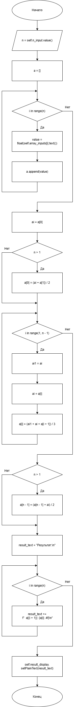
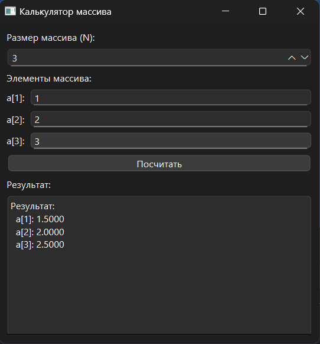

# Практическая работа №1

### Тема: Преобразование рядовых чисел

### Цель: приобрести навыки составления программ с использованием преобразования рядов чисел

#### Задачи:

* повторить структуру операторов цикла и их форму
* повторить синтаксис оператора циклов и формы их организации
* усовершеннствовать навыки составления программ с использованием циклов

#### Задание

> Дан массив размера N. Заменить каждый элемент массива на среднее арифметическое этого элементаа и его соседей.

#### Контрольный пример

> Ввожу массив [1, 2, 3]  
> Получаю [1.5, 2, 2.5]

#### Системный анализ

> Входные данные: `string n`  
> Промежуточные данные: `array a`, `float value`, `int ai`, `int n`, `int ai1`  
> Выходные данные: `string result_text`

#### Блок-схема



#### Код программы

```python
import sys
from PySide6.QtWidgets import (
    QApplication, QMainWindow, QWidget, QVBoxLayout, QLabel,
    QLineEdit, QPushButton, QTextEdit, QSpinBox, QHBoxLayout
)


class MainWindow(QMainWindow):
    def __init__(self):
        super().__init__()
        self.setWindowTitle("Калькулятор массива")
        self.setGeometry(100, 100, 400, 400)

        self.central_widget = QWidget()
        self.setCentralWidget(self.central_widget)

        self.layout = QVBoxLayout()
        self.central_widget.setLayout(self.layout)

        self.n_label = QLabel("Размер массива (N):")
        self.n_input = QSpinBox()
        self.n_input.setMinimum(1)
        self.n_input.setMaximum(10)
        self.layout.addWidget(self.n_label)
        self.layout.addWidget(self.n_input)

        self.array_inputs_layout = QVBoxLayout()
        self.array_inputs_label = QLabel("Элементы массива:")
        self.layout.addWidget(self.array_inputs_label)
        self.layout.addLayout(self.array_inputs_layout)
        self.array_inputs = []

        self.n_input.valueChanged.connect(self.update_array_inputs)

        self.calc_button = QPushButton("Посчитать")
        self.calc_button.clicked.connect(self.calculate)
        self.layout.addWidget(self.calc_button)

        self.result_label = QLabel("Результат:")
        self.result_display = QTextEdit()
        self.result_display.setReadOnly(True)
        self.layout.addWidget(self.result_label)
        self.layout.addWidget(self.result_display)

        self.update_array_inputs()

    def update_array_inputs(self):
        for i in reversed(range(self.array_inputs_layout.count())):
            layout_item = self.array_inputs_layout.itemAt(i)
            if layout_item.layout() is not None:
                sub_layout = layout_item.layout()
                for j in reversed(range(sub_layout.count())):
                    sub_layout.itemAt(j).widget().deleteLater()
                sub_layout.deleteLater()
        self.array_inputs.clear()

        n = self.n_input.value()
        for i in range(n):
            label = QLabel(f"a[{i + 1}]:")
            line_edit = QLineEdit()
            line_edit.setPlaceholderText("Введите число")
            line_edit.clear()
            hbox = QHBoxLayout()
            hbox.addWidget(label)
            hbox.addWidget(line_edit)
            self.array_inputs_layout.addLayout(hbox)
            self.array_inputs.append(line_edit)

    def calculate(self):
        try:
            n = self.n_input.value()
            a = []

            for i in range(n):
                value = float(self.array_inputs[i].text())
                a.append(value)

            ai = a[0]
            if n > 1:
                a[0] = (ai + a[1]) / 2

            for i in range(1, n - 1):
                ai1 = ai
                ai = a[i]
                a[i] = (ai1 + ai + a[i + 1]) / 3

            if n > 1:
                a[n - 1] = (a[n - 1] + ai) / 2

            result_text = "Результат:\n"
            for i in range(n):
                result_text += f"  a[{i + 1}]: {a[i]:.4f}\n"

            self.result_display.setPlainText(result_text)

        except ValueError:
            self.result_display.setPlainText("Ошибка: Введите корректные данные")


if __name__ == "__main__":
    app = QApplication(sys.argv)
    window = MainWindow()
    window.show()
    sys.exit(app.exec())
```

#### Результат работы программы



#### Вывод по проделанной работе

> +rep 👌🤐