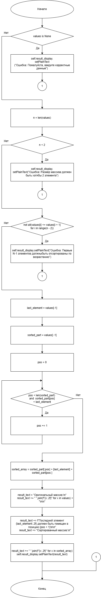
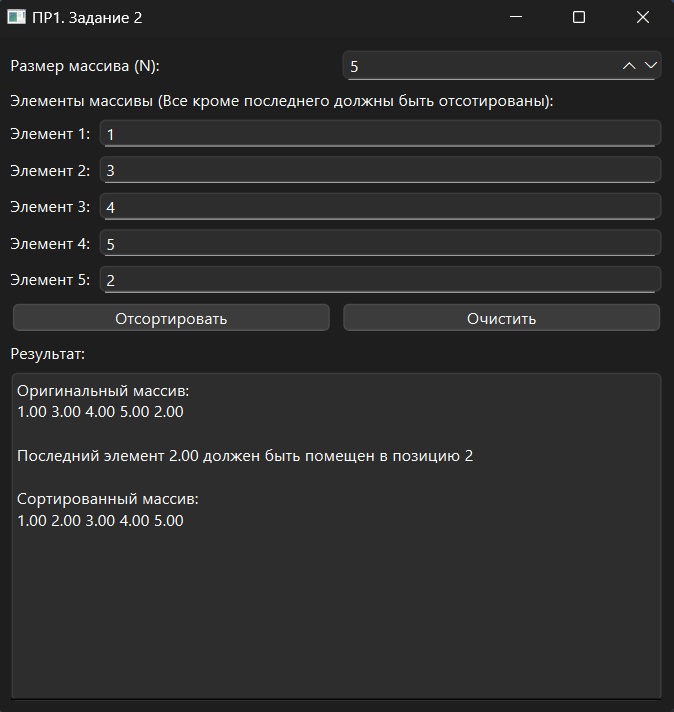

# Практическая работа №1

### Тема: Преобразование рядовых чисел

### Цель: приобрести навыки составления программ с использованием преобразования рядов чисел

#### Задачи:

* повторить структуру операторов цикла и их форму
* повторить синтаксис оператора циклов и формы их организации
* усовершеннствовать навыки составления программ с использованием циклов

#### Задание

> Дан массив размера N, все элементы которого, кроме последнего, упорядочены по возрастанию. Сделать массив
> упорядоченным, переместив последний элемент на новую позицию.

#### Контрольный пример

> Ввожу массив [1, 3, 4, 5, 2]
> Получаю [1, 2, 3, 4, 5]

#### Системный анализ

> Входные данные: `string values`  
> Промежуточные данные: `int n`, `float last_element`, `float sorted_part`, `int n`, `int ai1`  
> Выходные данные: `string result_text`

#### Блок-схема



#### Код программы

```python
import sys
from PySide6.QtWidgets import (
    QApplication, QMainWindow, QWidget, QVBoxLayout, QLabel,
    QLineEdit, QPushButton, QTextEdit, QSpinBox, QHBoxLayout
)


class ArraySorterApp(QMainWindow):
    def __init__(self):
        super().__init__()
        self.setWindowTitle("ПР1. Задание 2")
        self.setGeometry(100, 100, 500, 500)

        self.initUI()

    def initUI(self):
        self.central_widget = QWidget()
        self.setCentralWidget(self.central_widget)

        self.layout = QVBoxLayout()
        self.central_widget.setLayout(self.layout)

        self.size_layout = QHBoxLayout()
        self.size_label = QLabel("Размер массива (N):")
        self.size_input = QSpinBox()
        self.size_input.setMinimum(2)
        self.size_input.setMaximum(20)
        self.size_input.setValue(5)
        self.size_layout.addWidget(self.size_label)
        self.size_layout.addWidget(self.size_input)
        self.layout.addLayout(self.size_layout)

        self.array_inputs_layout = QVBoxLayout()
        self.array_label = QLabel("Элементы массивы (Все кроме последнего должны быть отсотированы):")
        self.layout.addWidget(self.array_label)
        self.layout.addLayout(self.array_inputs_layout)
        self.array_inputs = []

        self.size_input.valueChanged.connect(self.update_array_inputs)

        self.button_layout = QHBoxLayout()
        self.sort_button = QPushButton("Отсортировать")
        self.sort_button.clicked.connect(self.sort_array)
        # self.sort_button.height
        self.clear_button = QPushButton("Очистить")
        self.clear_button.clicked.connect(self.clear_all)
        self.button_layout.addWidget(self.sort_button)
        self.button_layout.addWidget(self.clear_button)
        self.layout.addLayout(self.button_layout)

        self.result_label = QLabel("Результат:")
        self.result_display = QTextEdit()
        self.result_display.setReadOnly(True)
        self.layout.addWidget(self.result_label)
        self.layout.addWidget(self.result_display)

        self.update_array_inputs()

    def update_array_inputs(self):
        for i in reversed(range(self.array_inputs_layout.count())):
            item = self.array_inputs_layout.itemAt(i)
            if item.layout():
                for j in reversed(range(item.layout().count())):
                    item.layout().itemAt(j).widget().deleteLater()
                item.layout().deleteLater()

        self.array_inputs.clear()

        n = self.size_input.value()
        for i in range(n):
            hbox = QHBoxLayout()
            label = QLabel(f"Элемент {i + 1}:")
            input_field = QLineEdit()
            input_field.setPlaceholderText("Введите число")
            hbox.addWidget(label)
            hbox.addWidget(input_field)
            self.array_inputs_layout.addLayout(hbox)
            self.array_inputs.append(input_field)

    def get_array_values(self):
        try:
            return [float(input.text()) for input in self.array_inputs if input.text()]
        except ValueError:
            return None

    def sort_array(self):
        values = self.get_array_values()
        if values is None:
            self.result_display.setPlainText("Ошибка: Пожалуйста, введите корректные данные")
            return

        n = len(values)
        if n < 2:
            self.result_display.setPlainText("Ошибка: Размер массива должен быть хотябы 2 элемента")
            return

        if not all(values[i] <= values[i + 1] for i in range(n - 2)):
            self.result_display.setPlainText("Ошибка: Первые N-1 элементов должныбыть отсортированы по возрастанию")
            return

        last_element = values[-1]
        sorted_part = values[:-1]

        pos = 0
        while pos < len(sorted_part) and sorted_part[pos] < last_element:
            pos += 1

        sorted_array = sorted_part[:pos] + [last_element] + sorted_part[pos:]

        result_text = "Оригинальный массив:\n"
        result_text += " ".join(f"{x:.2f}" for x in values) + "\n\n"
        result_text += f"Последний элемент {last_element:.2f} должен быть помещен в позицию {pos + 1}\n\n"
        result_text += "Сортированный массив:\n"
        result_text += " ".join(f"{x:.2f}" for x in sorted_array)

        self.result_display.setPlainText(result_text)

    def clear_all(self):
        self.size_input.setValue(5)
        for input_field in self.array_inputs:
            input_field.clear()
        self.result_display.clear()


if __name__ == "__main__":
    app = QApplication(sys.argv)
    window = ArraySorterApp()
    window.show()
    sys.exit(app.exec())
```

#### Результат работы программы



#### Вывод по проделанной работе

> +rep 👌🤐