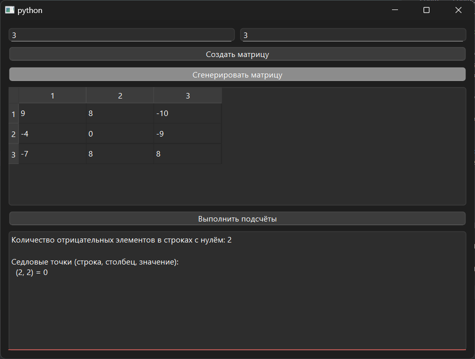

# Практическая работа №10

### Тема: обработка двумерных массивов с помощью подпрограммы

### Цель: приобрести навыки составления циклических программ с использованием двумерных массивов и подпрограмм

#### Задание

> Дана целочисленная прямоугольная матрица. Определить:
>* Количество отрицательных элементов в тех строках, которые содержат хотя бы один нулевой элемент (оформить в виде
   функции).
>* Номера строк и столбцов всех седловых точек матрицы (оформить в виде подпрограммы).

#### Контрольный пример

**Ввожу:**

| X1 | X2 | X3  |
|----|----|-----|
| 9  | 8  | -10 |
| -4 | 0  | -9  |
| -7 | 8  | 8   |

**Получаю:**

* Количество отрицательных элементов в строках с нулём: 2
* Седловые точки (строка, столбец, значение):
  (2, 2) = 0

#### Системный анализ

> Входные данные: `String rows` `String cols`  
> Промежуточные данные: `Array matrix` `Array row` `Integer val` `Integer neg_count` `Array saddle_pts`  
> Выходные данные: `output_text`

#### Блок-схема


#### Код программы

```python
import sys
import random
from PySide6.QtWidgets import (
    QApplication, QWidget, QVBoxLayout, QLabel,
    QLineEdit, QPushButton, QTableWidget, QTableWidgetItem,
    QMessageBox, QTextEdit, QHBoxLayout
)


def count_negatives_in_zero_rows(matrix):
    count = 0
    for row in matrix:
        if 0 in row:
            count += sum(1 for x in row if x < 0)
    return count


def find_saddle_points(matrix):
    saddle_points = []
    rows = len(matrix)
    cols = len(matrix[0]) if rows > 0 else 0

    for i in range(rows):
        for j in range(cols):
            elem = matrix[i][j]
            row = matrix[i]
            col = [matrix[r][j] for r in range(rows)]

            if elem == min(row) and elem == max(col):
                saddle_points.append((i, j))
            elif elem == max(row) and elem == min(col):
                saddle_points.append((i, j))
    return saddle_points


class MatrixApp(QWidget):
    def __init__(self):
        super().__init__()
        self.setWindowTitle("")
        self.setGeometry(100, 100, 700, 500)

        self.layout = QVBoxLayout()

        size_layout = QHBoxLayout()
        self.input_rows = QLineEdit()
        self.input_rows.setPlaceholderText("Количество строк")
        self.input_cols = QLineEdit()
        self.input_cols.setPlaceholderText("Количество столбцов")
        size_layout.addWidget(self.input_rows)
        size_layout.addWidget(self.input_cols)
        self.layout.addLayout(size_layout)

        self.btn_create = QPushButton("Создать матрицу")
        self.btn_create.clicked.connect(self.create_matrix)
        self.layout.addWidget(self.btn_create)

        self.btn_generate = QPushButton("Сгенерировать матрицу")
        self.btn_generate.clicked.connect(self.generate_matrix)
        self.layout.addWidget(self.btn_generate)

        self.table = QTableWidget()
        self.layout.addWidget(self.table)

        self.btn_process = QPushButton("Выполнить подсчёты")
        self.btn_process.clicked.connect(self.process_matrix)
        self.layout.addWidget(self.btn_process)

        self.output = QTextEdit()
        self.output.setReadOnly(True)
        self.layout.addWidget(self.output)

        self.setLayout(self.layout)

    def generate_matrix(self):
        try:
            rows = int(self.input_rows.text())
            cols = int(self.input_cols.text())
            if rows <= 0 or cols <= 0:
                raise ValueError
        except ValueError:
            QMessageBox.critical(self, "Ошибка", "Введите корректные положительные размеры.")
            return

        self.table.setRowCount(rows)
        self.table.setColumnCount(cols)
        for i in range(rows):
            for j in range(cols):
                val = random.randint(-10, 10)
                item = QTableWidgetItem(str(val))
                self.table.setItem(i, j, item)

    def create_matrix(self):
        try:
            rows = int(self.input_rows.text())
            cols = int(self.input_cols.text())
            if rows <= 0 or cols <= 0:
                raise ValueError
        except ValueError:
            QMessageBox.critical(self, "Ошибка", "Введите корректные положительные размеры.")
            return

        self.table.setRowCount(rows)
        self.table.setColumnCount(cols)

    def process_matrix(self):
        rows = self.table.rowCount()
        cols = self.table.columnCount()
        if rows == 0 or cols == 0:
            QMessageBox.warning(self, "Внимание", "Матрица пуста.")
            return

        matrix = []
        for i in range(rows):
            row = []
            for j in range(cols):
                item = self.table.item(i, j)
                if item is None:
                    QMessageBox.warning(self, "Ошибка", f"Ячейка ({i + 1},{j + 1}) пуста.")
                    return
                try:
                    val = int(item.text())
                except ValueError:
                    QMessageBox.warning(self, "Ошибка", f"Некорректное значение в ячейке ({i + 1},{j + 1}).")
                    return
                row.append(val)
            matrix.append(row)

        neg_count = count_negatives_in_zero_rows(matrix)
        saddle_pts = find_saddle_points(matrix)

        output_text = f"Количество отрицательных элементов в строках с нулём: {neg_count}\n\n"
        if saddle_pts:
            output_text += "Седловые точки (строка, столбец, значение):\n"
            for i, j in saddle_pts:
                output_text += f"  ({i + 1}, {j + 1}) = {matrix[i][j]}\n"
        else:
            output_text += "Седловых точек не найдено."

        self.output.setText(output_text)


if __name__ == "__main__":
    app = QApplication(sys.argv)
    win = MatrixApp()
    win.show()
    sys.exit(app.exec())

```

#### Результат работы программы



#### Вывод по проделанной работе

> 