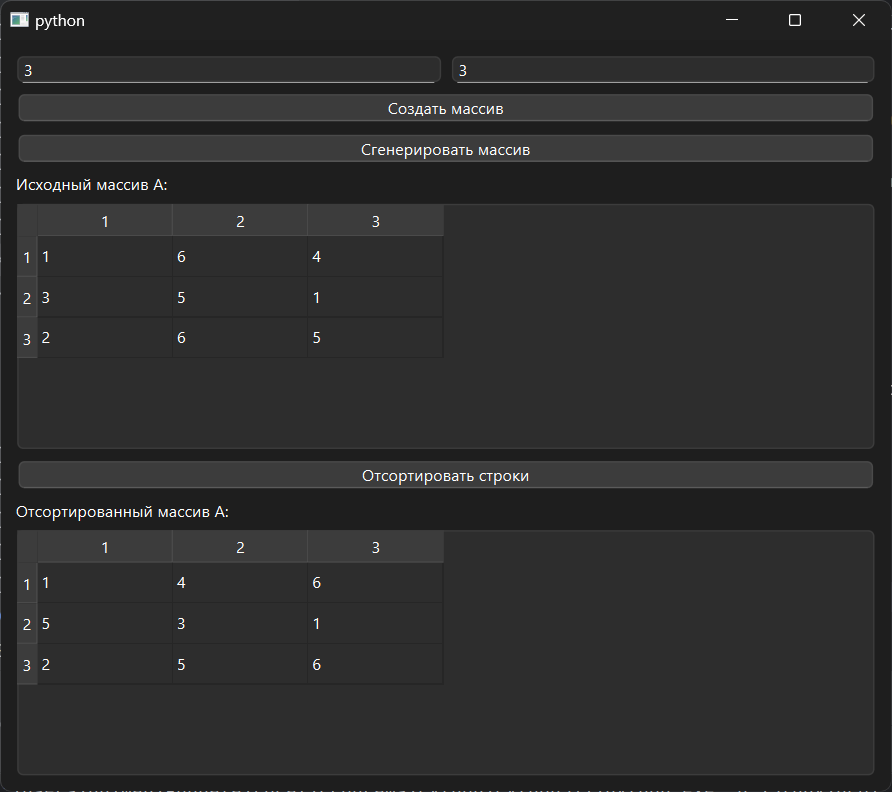

# Практическая работа №10

### Тема: обработка двумерных массивов с помощью подпрограммы

### Цель: приобрести навыки составления циклических программ с использованием двумерных массивов и подпрограмм

#### Задание

> В массиве А[m,n] четные строки отсортировать по возрастанию, нечетные – по убыванию.

#### Контрольный пример

**Ввожу:**

| X1 | X2 | X3 |
|:--:|:--:|:--:|
| 1  | 6  | 4  |
| 3  | 5  | 1  |
| 2  | 6  | 5  |

**Получаю:**

| X1 | X2 | X3 |
|:--:|:--:|:--:|
| 1  | 4  | 6  |
| 5  | 3  | 1  |
| 2  | 5  | 6  |

#### Системный анализ

> Входные данные: `String rows` `String cols`  
> Промежуточные данные: `Array matrix` `Array row` `Array sorted_row`  
> Выходные данные: `Array sorted_matrix`  

#### Блок-схема


#### Код программы

```python
import sys
import random
from PySide6.QtWidgets import (
    QApplication, QWidget, QVBoxLayout, QLabel,
    QPushButton, QLineEdit, QMessageBox, QTableWidget,
    QTableWidgetItem, QHBoxLayout
)


class SortMatrixRows(QWidget):
    def __init__(self):
        super().__init__()
        self.setWindowTitle("")
        self.setGeometry(100, 100, 600, 400)

        self.layout = QVBoxLayout()

        size_layout = QHBoxLayout()
        self.input_rows = QLineEdit()
        self.input_rows.setPlaceholderText("Количество строк (m)")
        self.input_cols = QLineEdit()
        self.input_cols.setPlaceholderText("Количество столбцов (n)")
        size_layout.addWidget(self.input_rows)
        size_layout.addWidget(self.input_cols)
        self.layout.addLayout(size_layout)

        self.btn_create = QPushButton("Создать массив")
        self.btn_create.clicked.connect(self.create_matrix)
        self.layout.addWidget(self.btn_create)

        self.btn_generate = QPushButton("Сгенерировать массив")
        self.btn_generate.clicked.connect(self.generate_matrix)
        self.layout.addWidget(self.btn_generate)

        self.label_original = QLabel("Исходный массив A:")
        self.layout.addWidget(self.label_original)
        self.table_original = QTableWidget()
        self.layout.addWidget(self.table_original)

        self.btn_sort = QPushButton("Отсортировать строки")
        self.btn_sort.clicked.connect(self.sort_rows)
        self.layout.addWidget(self.btn_sort)

        self.label_sorted = QLabel("Отсортированный массив A:")
        self.layout.addWidget(self.label_sorted)
        self.table_sorted = QTableWidget()
        self.layout.addWidget(self.table_sorted)

        self.setLayout(self.layout)

    def create_matrix(self):
        try:
            m = int(self.input_rows.text())
            n = int(self.input_cols.text())
            if m <= 0 or n <= 0:
                raise ValueError
        except ValueError:
            QMessageBox.critical(self, "Ошибка", "Введите корректные размеры.")
            return

        self.table_original.setRowCount(m)
        self.table_original.setColumnCount(n)

    def generate_matrix(self):
        try:
            m = int(self.input_rows.text())
            n = int(self.input_cols.text())
            if m <= 0 or n <= 0:
                raise ValueError
        except ValueError:
            QMessageBox.critical(self, "Ошибка", "Введите корректные размеры.")
            return

        for i in range(m):
            for j in range(n):
                val = random.randint(1, 99)
                item = QTableWidgetItem(str(val))
                self.table_original.setItem(i, j, item)

    def sort_rows(self):
        try:
            rows = self.table_original.rowCount()
            cols = self.table_original.columnCount()

            matrix = []
            for i in range(rows):
                row = []
                for j in range(cols):
                    item = self.table_original.item(i, j)
                    if item is None:
                        raise ValueError(f"Некорректные данные в ячейке ({i + 1}, {j + 1}).")
                    row.append(int(item.text()))
                matrix.append(row)

            sorted_matrix = []
            for i, row in enumerate(matrix):
                if i % 2 == 0:
                    sorted_row = sorted(row)
                else:
                    sorted_row = sorted(row, reverse=True)
                sorted_matrix.append(sorted_row)

            self.display_table(self.table_sorted, sorted_matrix)

        except ValueError as e:
            QMessageBox.warning(self, "Ошибка", str(e))

    def display_table(self, table, data):
        rows = len(data)
        cols = len(data[0]) if rows > 0 else 0
        table.setRowCount(rows)
        table.setColumnCount(cols)
        for i in range(rows):
            for j in range(cols):
                table.setItem(i, j, QTableWidgetItem(str(data[i][j])))


if __name__ == "__main__":
    app = QApplication(sys.argv)
    window = SortMatrixRows()
    window.show()
    sys.exit(app.exec())

```

#### Результат работы программы



#### Вывод по проделанной работе

> 