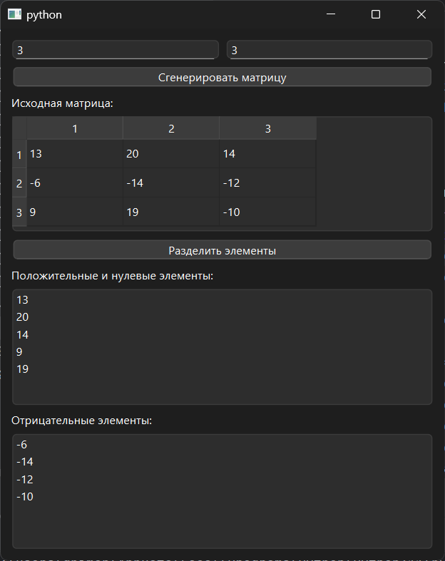

# Практическая работа №11

### Тема: использование двумерных массивов

### Цель: приобрести навыки составления циклических программ с использованием двумерных массивов

#### Задание

> Имеется двухмерный массив целых чисел. Создать из него два одномерных массива, в одном из которых расположены
> положительные и нулевые элементы, а в другом – отрицательные элементы.

#### Контрольный пример

Ввожу:

| X1  | X2 | X3  |
|-----|----|-----|
| -13 | -2 | -17 |
| 7   | 3  | 16  |
| 0   | 11 | 7   |

Получаю  
7 3 16 0 11 7  
И  
-13 -2 -17

#### Системный анализ

> Входные данные: `Array matrix`  
> Промежуточные данные: `Array row` `Array val`  
> Выходные данные: `Array pos_zero` `Array neg`

#### Блок-схема


#### Код программы

```python
import sys
import random
from PySide6.QtWidgets import (
    QApplication, QWidget, QVBoxLayout, QLabel,
    QLineEdit, QPushButton, QListWidget, QHBoxLayout, QMessageBox, QTableWidget, QTableWidgetItem
)


class SplitMatrixElements(QWidget):
    def __init__(self):
        super().__init__()
        self.setWindowTitle("")
        self.setGeometry(100, 100, 600, 450)

        layout = QVBoxLayout()

        size_layout = QHBoxLayout()
        self.input_rows = QLineEdit()
        self.input_rows.setPlaceholderText("Количество строк")
        self.input_cols = QLineEdit()
        self.input_cols.setPlaceholderText("Количество столбцов")
        size_layout.addWidget(self.input_rows)
        size_layout.addWidget(self.input_cols)
        layout.addLayout(size_layout)

        self.btn_generate = QPushButton("Сгенерировать матрицу")
        self.btn_generate.clicked.connect(self.generate_matrix)
        layout.addWidget(self.btn_generate)

        self.label_matrix = QLabel("Исходная матрица:")
        layout.addWidget(self.label_matrix)
        self.table_matrix = QTableWidget()
        layout.addWidget(self.table_matrix)

        self.btn_split = QPushButton("Разделить элементы")
        self.btn_split.clicked.connect(self.split_elements)
        layout.addWidget(self.btn_split)

        self.label_pos_zero = QLabel("Положительные и нулевые элементы:")
        layout.addWidget(self.label_pos_zero)
        self.list_pos_zero = QListWidget()
        layout.addWidget(self.list_pos_zero)

        self.label_neg = QLabel("Отрицательные элементы:")
        layout.addWidget(self.label_neg)
        self.list_neg = QListWidget()
        layout.addWidget(self.list_neg)

        self.setLayout(layout)

    def generate_matrix(self):
        try:
            rows = int(self.input_rows.text())
            cols = int(self.input_cols.text())
            if rows <= 0 or cols <= 0:
                raise ValueError
        except ValueError:
            QMessageBox.critical(self, "Ошибка", "Введите корректные размеры матрицы.")
            return

        self.matrix = [[random.randint(-20, 20) for _ in range(cols)] for _ in range(rows)]

        self.display_table(self.table_matrix, self.matrix)

        self.list_pos_zero.clear()
        self.list_neg.clear()

    def split_elements(self):
        try:
            rows = self.table_matrix.rowCount()
            cols = self.table_matrix.columnCount()

            matrix = []
            for i in range(rows):
                row = []
                for j in range(cols):
                    item = self.table_matrix.item(i, j)
                    if item is None:
                        raise ValueError(f"Некорректные данные в ячейке ({i + 1}, {j + 1}).")
                    try:
                        val = int(item.text())
                    except ValueError:
                        raise ValueError(f"Некорректное значение в ячейке ({i + 1}, {j + 1}).")
                    row.append(val)
                matrix.append(row)

            pos_zero = []
            neg = []
            for row in matrix:
                for val in row:
                    if val >= 0:
                        pos_zero.append(val)
                    else:
                        neg.append(val)

            self.list_pos_zero.clear()
            self.list_pos_zero.addItems(map(str, pos_zero))

            self.list_neg.clear()
            self.list_neg.addItems(map(str, neg))

        except ValueError as e:
            QMessageBox.warning(self, "Ошибка", str(e))

    def display_table(self, table, data):
        rows = len(data)
        cols = len(data[0]) if rows > 0 else 0
        table.setRowCount(rows)
        table.setColumnCount(cols)
        for i in range(rows):
            for j in range(cols):
                table.setItem(i, j, QTableWidgetItem(str(data[i][j])))


if __name__ == "__main__":
    app = QApplication(sys.argv)
    window = SplitMatrixElements()
    window.show()
    sys.exit(app.exec())
```

#### Результат работы программы



#### Вывод по проделанной работе

> 