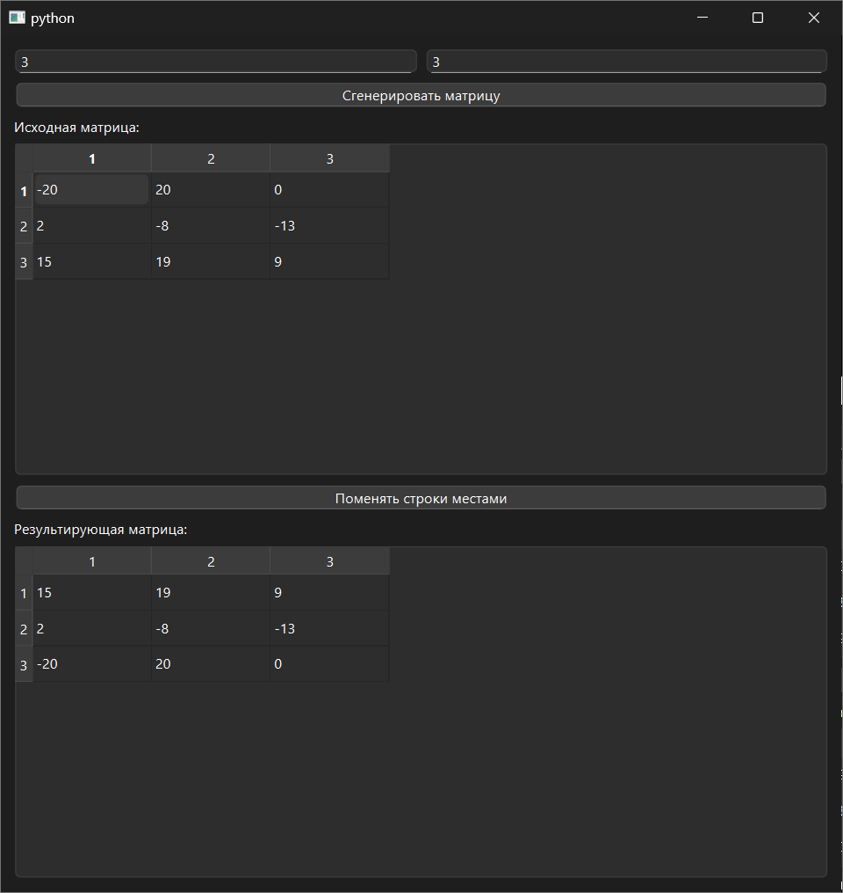

# Практическая работа №11

### Тема: использование двумерных массивов

### Цель: приобрести навыки составления циклических программ с использованием двумерных массивов

#### Задание

> В двухмерном массиве целых чисел поменять места¬ми строки, симметричные относительно середины массива (горизонтальной
> линии).

#### Контрольный пример

Ввожу:

| X1  | X2 | X3  |
|-----|----|-----|
| -20 | 20 | 0   |
| 2   | -8 | -13 |
| 15  | 19 | 9   |

Получаю: 

| X1  | X2 | X3  |
|-----|----|-----|
| 15  | 19 | 9   |
| 2   | -8 | -13 |
| -20 | 20 | 0   |

#### Системный анализ

> Входные данные: `Integer rows` `Integer cols`  
> Промежуточные данные: `Array matrix` `Array row` `Array item` `Integer val` `Integer n`  
> Выходные данные: `Array swapped`  

#### Блок-схема


#### Код программы

```python
import sys
import random
from PySide6.QtWidgets import (
    QApplication, QWidget, QVBoxLayout, QLabel,
    QPushButton, QLineEdit, QMessageBox, QTableWidget, QTableWidgetItem, QHBoxLayout
)


class MirrorSwapRows(QWidget):
    def __init__(self):
        super().__init__()
        self.setWindowTitle("")
        self.setGeometry(100, 100, 600, 400)

        layout = QVBoxLayout()

        size_layout = QHBoxLayout()
        self.input_rows = QLineEdit()
        self.input_rows.setPlaceholderText("Количество строк")
        self.input_cols = QLineEdit()
        self.input_cols.setPlaceholderText("Количество столбцов")
        size_layout.addWidget(self.input_rows)
        size_layout.addWidget(self.input_cols)
        layout.addLayout(size_layout)

        self.btn_generate = QPushButton("Сгенерировать матрицу")
        self.btn_generate.clicked.connect(self.generate_matrix)
        layout.addWidget(self.btn_generate)

        self.label_original = QLabel("Исходная матрица:")
        layout.addWidget(self.label_original)
        self.table_original = QTableWidget()
        layout.addWidget(self.table_original)

        self.btn_swap = QPushButton("Поменять строки местами")
        self.btn_swap.clicked.connect(self.swap_rows)
        layout.addWidget(self.btn_swap)

        self.label_result = QLabel("Результирующая матрица:")
        layout.addWidget(self.label_result)
        self.table_result = QTableWidget()
        layout.addWidget(self.table_result)

        self.setLayout(layout)

    def generate_matrix(self):
        try:
            rows = int(self.input_rows.text())
            cols = int(self.input_cols.text())
            if rows <= 1 or cols <= 0:
                raise ValueError
        except ValueError:
            QMessageBox.critical(self, "Ошибка", "Введите корректные размеры (строк > 1, столбцов > 0).")
            return

        self.table_original.setRowCount(rows)
        self.table_original.setColumnCount(cols)

        for i in range(rows):
            for j in range(cols):
                val = random.randint(-20, 20)
                self.table_original.setItem(i, j, QTableWidgetItem(str(val)))

        self.table_result.clear()

    def swap_rows(self):
        try:
            rows = self.table_original.rowCount()
            cols = self.table_original.columnCount()

            matrix = []
            for i in range(rows):
                row = []
                for j in range(cols):
                    item = self.table_original.item(i, j)
                    if item is None:
                        raise ValueError(f"Некорректные данные в ячейке ({i+1}, {j+1}).")
                    try:
                        val = int(item.text())
                    except ValueError:
                        raise ValueError(f"Некорректное значение в ячейке ({i+1}, {j+1}).")
                    row.append(val)
                matrix.append(row)

            swapped = [row[:] for row in matrix]
            n = len(swapped)
            for i in range(n // 2):
                swapped[i], swapped[n - 1 - i] = swapped[n - 1 - i], swapped[i]

            self.display_table(self.table_result, swapped)

        except ValueError as e:
            QMessageBox.warning(self, "Ошибка", str(e))

    def display_table(self, table, data):
        rows = len(data)
        cols = len(data[0]) if rows > 0 else 0
        table.setRowCount(rows)
        table.setColumnCount(cols)
        for i in range(rows):
            for j in range(cols):
                table.setItem(i, j, QTableWidgetItem(str(data[i][j])))


if __name__ == "__main__":
    app = QApplication(sys.argv)
    window = MirrorSwapRows()
    window.show()
    sys.exit(app.exec())

```

#### Результат работы программы



#### Вывод по проделанной работе

> 