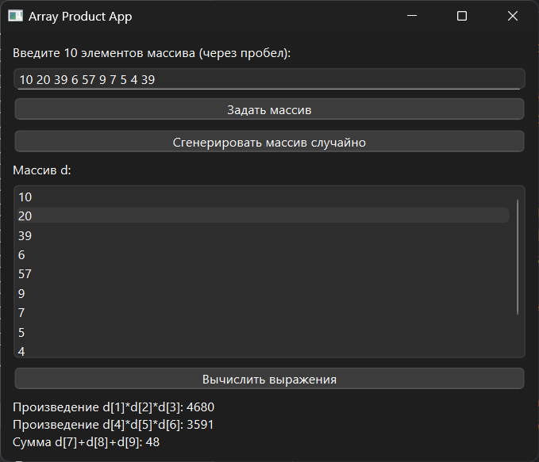

# Практическая работа №12

### Тема: решение задач с процедурами

### Цель: приобрести навыки составления циклических программ с использованием функций и процедур

#### Задание

> Задан массив d. определить следующие произведения: d[l] * d[2] * d[3]; d[4] * d[5] * d[6]; d[7] + d[8] + d[9]. (
> Составить подпрограмму для вычисления произведения трех последовательно расположенных элементов массива с номерами от
> k
> до S).

#### Контрольный пример

> Ввожу 10 20 39 6 57 9 7 5 4 39 Получаю:
> Произведение d1 d2 d3: 4680
> Произведение d4 d5 d6: 3591
> Сумма d7 d8 d9: 48

#### Системный анализ

> Входные данные: `Array d`  
> Промежуточные данные: `Array p1` `Array p2` `Array s3`  
> Выходные данные: `String label_result`

#### Блок-схема


#### Код программы

```python
import sys
import random
from PySide6.QtWidgets import (
    QApplication, QWidget, QVBoxLayout, QLabel,
    QPushButton, QListWidget, QMessageBox, QLineEdit, QHBoxLayout
)


def product_subarray(d, k, s):
    if s - k + 1 != 3:
        raise ValueError("Подмассив должен содержать ровно 3 элемента")
    prod = 1
    for i in range(k, s + 1):
        prod *= d[i]
    return prod


class ArrayProductApp(QWidget):
    def __init__(self):
        super().__init__()
        self.setWindowTitle("")
        self.setGeometry(100, 100, 500, 400)

        layout = QVBoxLayout()

        self.label_instructions = QLabel("Введите 10 элементов массива (через пробел):")
        layout.addWidget(self.label_instructions)

        self.input_line = QLineEdit()
        self.input_line.setPlaceholderText("Введите элементы массива")
        layout.addWidget(self.input_line)

        self.btn_set_array = QPushButton("Задать массив")
        self.btn_set_array.clicked.connect(self.set_array)
        layout.addWidget(self.btn_set_array)

        self.btn_generate = QPushButton("Сгенерировать массив случайно")
        self.btn_generate.clicked.connect(self.generate_array)
        layout.addWidget(self.btn_generate)

        self.list_array = QListWidget()
        layout.addWidget(QLabel("Массив d:"))
        layout.addWidget(self.list_array)

        self.btn_compute = QPushButton("Вычислить выражения")
        self.btn_compute.clicked.connect(self.compute_results)
        layout.addWidget(self.btn_compute)

        self.label_result = QLabel("")
        layout.addWidget(self.label_result)

        self.setLayout(layout)

    def set_array(self):
        input_text = self.input_line.text()
        try:
            self.d = list(map(int, input_text.split()))
            if len(self.d) != 10:
                raise ValueError("Массив должен содержать ровно 10 элементов.")
        except ValueError as e:
            QMessageBox.critical(self, "Ошибка", str(e))
            return

        self.list_array.clear()
        self.list_array.addItems(map(str, self.d))
        self.label_result.setText("")

    def generate_array(self):
        self.d = [random.randint(1, 10) for _ in range(10)]

        self.list_array.clear()
        self.list_array.addItems(map(str, self.d))
        self.label_result.setText("")

    def compute_results(self):
        if not hasattr(self, 'd'):
            QMessageBox.warning(self, "Внимание", "Сначала задайте или сгенерируйте массив.")
            return

        try:
            p1 = product_subarray(self.d, 1, 3)
            p2 = product_subarray(self.d, 4, 6)
            s3 = self.d[7] + self.d[8] + self.d[9]
        except IndexError:
            QMessageBox.critical(self, "Ошибка", "Массив должен содержать минимум 10 элементов.")
            return
        except ValueError as e:
            QMessageBox.critical(self, "Ошибка", str(e))
            return

        result_text = (
            f"Произведение d[1]*d[2]*d[3]: {p1}\n"
            f"Произведение d[4]*d[5]*d[6]: {p2}\n"
            f"Сумма d[7]+d[8]+d[9]: {s3}"
        )
        self.label_result.setText(result_text)


if __name__ == "__main__":
    app = QApplication(sys.argv)
    window = ArrayProductApp()
    window.show()
    sys.exit(app.exec())

```

#### Результат работы программы



#### Вывод по проделанной работе

> 