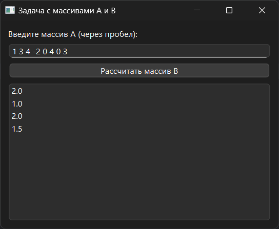

# Практическая работа №12

### Тема: решение задач с процедурами

### Цель: приобрести навыки составления циклических программ с использованием функций и процедур

#### Задание

> Повторите тему «Использование модулей» Дан массив a(N) (N — четное). Сформировать массив В(m), элементами которого
> являются средние арифметические соседних пар рядом стоящих в массиве А чисел. (например, массив А состоит из элементов
> 1; 3; 5; -2; 0; 4; 0; 3. элементами массива в будут 2; 1,5; 2; 1,5).

#### Контрольный пример

> Ввожу 1 3 4 -2 0 4 0 3
> Получаю 2.0 1.0 2.0 1.5

#### Системный анализ

> Входные данные: `String input_text`    
> Промежуточные данные: `Array a` `Array b` `Array value`
> Выходные данные: `String result`

#### Блок-схема


#### Код программы

```python
import sys
from PySide6.QtWidgets import (
    QApplication, QWidget, QVBoxLayout, QLabel,
    QPushButton, QLineEdit, QMessageBox
)


def gcd(a, b):
    while b:
        a, b = b, a % b
    return a


def gcd_four(a, b, c, d):
    return gcd(gcd(a, b), gcd(c, d))


class GCDApp(QWidget):
    def __init__(self):
        super().__init__()
        self.setWindowTitle("")
        self.setGeometry(100, 100, 350, 250)

        layout = QVBoxLayout()

        self.inputs = []
        for i in range(4):
            inp = QLineEdit()
            inp.setPlaceholderText(f"Введите натуральное число #{i + 1}")
            layout.addWidget(inp)
            self.inputs.append(inp)

        self.btn_calc = QPushButton("Вычислить НОД")
        self.btn_calc.clicked.connect(self.calculate_gcd)
        layout.addWidget(self.btn_calc)

        self.label_result = QLabel("")
        layout.addWidget(self.label_result)

        self.setLayout(layout)

    def calculate_gcd(self):
        try:
            numbers = [int(inp.text()) for inp in self.inputs]
            if any(n <= 0 for n in numbers):
                raise ValueError
        except ValueError:
            QMessageBox.critical(self, "Ошибка", "Введите 4 натуральных числа (>0).")
            return

        result = gcd_four(*numbers)
        self.label_result.setText(f"НОД чисел {numbers} = {result}")


if __name__ == "__main__":
    app = QApplication(sys.argv)
    window = GCDApp()
    window.show()
    sys.exit(app.exec())

```

#### Результат работы программы



#### Вывод по проделанной работе

> 