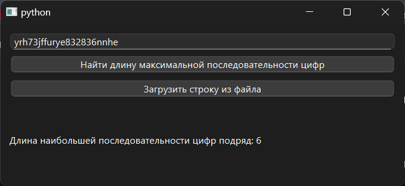

# Практическая работа №13

### Тема: использование функций

### Цель: приобрести навыки составления программ с использованием символьных данных

#### Задание

> Имеется строка, содержащая буквы латинского алфавита и цифры. Вывести на экран длину наибольшей последовательности
> цифр, идущих подряд.

#### Контрольный пример

> Ввожу: yrh73jffurye832836nnhe
> Получаю: 6

#### Системный анализ

> Входные данные: `String s`  
> Промежуточные данные: `Integer max_len`  
> Выходные данные: `String result_label`

#### Блок-схема


#### Код программы

```python
import sys
import re
from PySide6.QtWidgets import (
    QApplication, QWidget, QVBoxLayout, QLabel,
    QLineEdit, QPushButton, QMessageBox, QFileDialog
)


class LongestDigitSequence(QWidget):
    def __init__(self):
        super().__init__()
        self.setWindowTitle("")
        self.setGeometry(100, 100, 500, 200)

        layout = QVBoxLayout()

        self.input_str = QLineEdit()
        self.input_str.setPlaceholderText("Введите строку (латинские буквы и цифры)")
        layout.addWidget(self.input_str)

        btn_check = QPushButton("Найти длину максимальной последовательности цифр")
        btn_check.clicked.connect(self.process_input)
        layout.addWidget(btn_check)

        btn_load = QPushButton("Загрузить строку из файла")
        btn_load.clicked.connect(self.load_from_file)
        layout.addWidget(btn_load)

        self.result_label = QLabel("")
        layout.addWidget(self.result_label)

        self.setLayout(layout)

    def process_input(self):
        s = self.input_str.text()
        if not s:
            QMessageBox.warning(self, "Ошибка", "Строка не должна быть пустой.")
            return
        if not re.fullmatch(r'[A-Za-z0-9]+', s):
            QMessageBox.warning(self, "Ошибка", "Строка должна содержать только латинские буквы и цифры.")
            return

        max_len = self.find_max_digit_sequence(s)
        self.result_label.setText(f"Длина наибольшей последовательности цифр подряд: {max_len}")

    def find_max_digit_sequence(self, s):
        max_len = 0
        current_len = 0
        for ch in s:
            if ch.isdigit():
                current_len += 1
                if current_len > max_len:
                    max_len = current_len
            else:
                current_len = 0
        return max_len

    def load_from_file(self):
        file_path, _ = QFileDialog.getOpenFileName(self, "Открыть файл", "", "Text Files (*.txt);;All Files (*)")
        if file_path:
            try:
                with open(file_path, 'r', encoding='utf-8') as f:
                    content = f.read().strip()
                self.input_str.setText(content)
            except Exception as e:
                QMessageBox.critical(self, "Ошибка", f"Не удалось прочитать файл:\n{e}")


if __name__ == "__main__":
    app = QApplication(sys.argv)
    window = LongestDigitSequence()
    window.show()
    sys.exit(app.exec())

```

#### Результат работы программы



#### Вывод по проделанной работе

> 