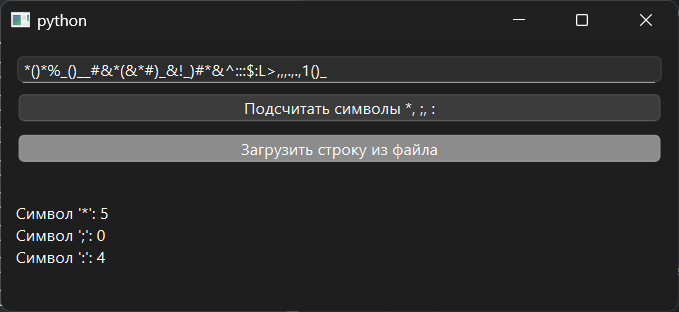

# Практическая работа №13

### Тема: использование функций

### Цель: приобрести навыки составления программ с использованием символьных данных

#### Задание

> Дана строка. Определить, сколько в ней символов *, ;, :.

#### Контрольный пример

> Ввожу: j*e;;ir:h  
> Получаю: * - 1, ; - 2, : - 1

#### Системный анализ

> Входные данные: `String s`    
> Промежуточные данные: `Integer count_star` `Integer count_semicolon` `Integer count_colon`  
> Выходные данные: `String result`

#### Блок-схема


#### Код программы

```python
import sys
from PySide6.QtWidgets import (
    QApplication, QWidget, QVBoxLayout, QLabel,
    QLineEdit, QPushButton, QMessageBox, QFileDialog
)


class CountSymbolsApp(QWidget):
    def __init__(self):
        super().__init__()
        self.setWindowTitle("")
        self.setGeometry(100, 100, 500, 200)

        layout = QVBoxLayout()

        self.input_str = QLineEdit()
        self.input_str.setPlaceholderText("Введите строку")
        layout.addWidget(self.input_str)

        btn_count = QPushButton("Подсчитать символы *, ;, :")
        btn_count.clicked.connect(self.count_symbols)
        layout.addWidget(btn_count)

        btn_load = QPushButton("Загрузить строку из файла")
        btn_load.clicked.connect(self.load_from_file)
        layout.addWidget(btn_load)

        self.result_label = QLabel("")
        layout.addWidget(self.result_label)

        self.setLayout(layout)

    def count_symbols(self):
        s = self.input_str.text()
        if not s:
            QMessageBox.warning(self, "Ошибка", "Строка не должна быть пустой.")
            return

        count_star = s.count('*')
        count_semicolon = s.count(';')
        count_colon = s.count(':')

        result = (
            f"Символ '*': {count_star}\n"
            f"Символ ';': {count_semicolon}\n"
            f"Символ ':': {count_colon}"
        )
        self.result_label.setText(result)

    def load_from_file(self):
        file_path, _ = QFileDialog.getOpenFileName(self, "Открыть файл", "", "Text Files (*.txt);;All Files (*)")
        if file_path:
            try:
                with open(file_path, 'r', encoding='utf-8') as f:
                    content = f.read().strip()
                self.input_str.setText(content)
            except Exception as e:
                QMessageBox.critical(self, "Ошибка", f"Не удалось прочитать файл:\n{e}")


if __name__ == "__main__":
    app = QApplication(sys.argv)
    window = CountSymbolsApp()
    window.show()
    sys.exit(app.exec())

```

#### Результат работы программы



#### Вывод по проделанной работе

> 