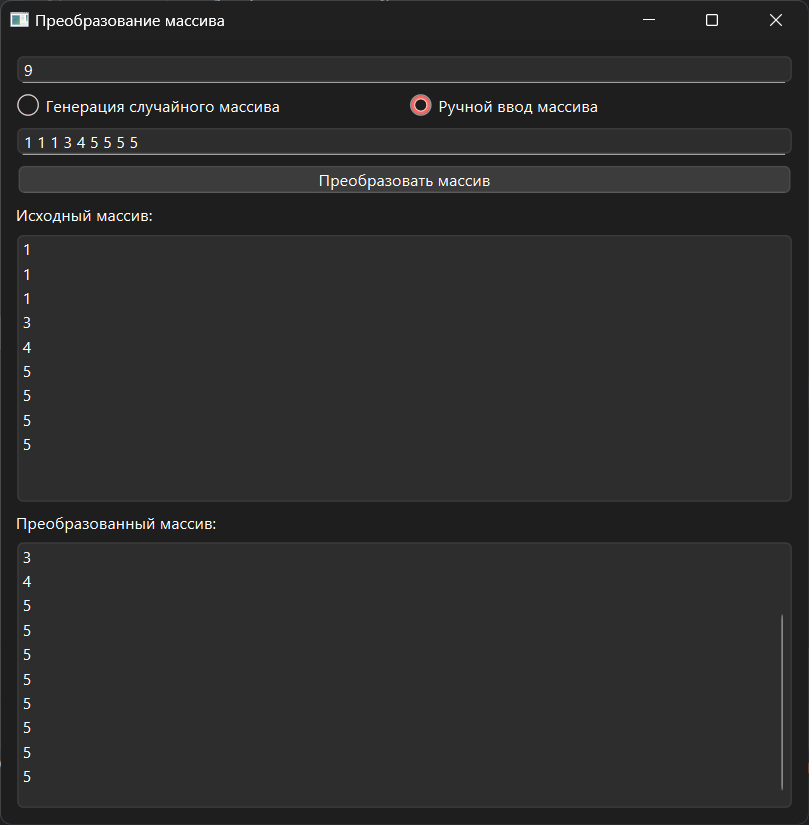

# Практическая работа №14

### Тема: использование серии чисел

### Цель: приобрести навыки составления программ с использованием преобразования серии чисел

#### Задание

> Дан целочисленный массив размера N. Преобразовать массив, увеличив его последнюю серию наибольшей длины на один

#### Контрольный пример

> Ввожу: 1 1 1 3 4 5 5 5 5  
> Получаю 1 1 1 3 4 5 5 5 5 5

#### Системный анализ

> Входные данные:  `Integer n` `String input_text` `Array arr`  
> Промежуточные данные: `Integer max_len` `Integer current_len` `Array runs` `Integer last_max_run` `Integer start`
`Integer length`  
> Выходные данные: `Array list_original`

#### Блок-схема


#### Код программы

```python
import sys
import random
from PySide6.QtWidgets import (
    QApplication, QWidget, QVBoxLayout, QLabel,
    QLineEdit, QPushButton, QListWidget, QMessageBox, QRadioButton, QHBoxLayout
)


class IncreaseLastLongestRun(QWidget):
    def __init__(self):
        super().__init__()
        self.setWindowTitle("Преобразование массива")
        self.setGeometry(100, 100, 500, 400)

        layout = QVBoxLayout()

        self.input_n = QLineEdit()
        self.input_n.setPlaceholderText("Введите размер массива N")
        layout.addWidget(self.input_n)

        self.generate_radio = QRadioButton("Генерация случайного массива")
        self.manual_radio = QRadioButton("Ручной ввод массива")
        self.generate_radio.setChecked(True)

        radio_layout = QHBoxLayout()
        radio_layout.addWidget(self.generate_radio)
        radio_layout.addWidget(self.manual_radio)
        layout.addLayout(radio_layout)

        self.input_manual = QLineEdit()
        self.input_manual.setPlaceholderText("Введите массив вручную (через пробел)")
        self.input_manual.setEnabled(False)
        layout.addWidget(self.input_manual)

        self.btn_process = QPushButton("Преобразовать массив")
        self.btn_process.clicked.connect(self.process_array)
        layout.addWidget(self.btn_process)

        self.list_original = QListWidget()
        layout.addWidget(QLabel("Исходный массив:"))
        layout.addWidget(self.list_original)

        self.list_result = QListWidget()
        layout.addWidget(QLabel("Преобразованный массив:"))
        layout.addWidget(self.list_result)

        self.setLayout(layout)

        self.generate_radio.toggled.connect(self.toggle_input_mode)
        self.manual_radio.toggled.connect(self.toggle_input_mode)

    def toggle_input_mode(self):
        if self.generate_radio.isChecked():
            self.input_manual.setEnabled(False)
        else:
            self.input_manual.setEnabled(True)

    def process_array(self):
        try:
            n = int(self.input_n.text())
            if n <= 0:
                raise ValueError("Размер массива должен быть положительным числом.")
        except ValueError as e:
            QMessageBox.critical(self, "Ошибка", f"Введите корректное положительное число. {e}")
            return

        if self.generate_radio.isChecked():
            arr = [random.randint(1, 10) for _ in range(n)]
        else:
            input_text = self.input_manual.text()
            arr = list(map(int, input_text.split()))
            if len(arr) != n:
                QMessageBox.critical(self, "Ошибка",
                                     "Количество элементов в массиве не соответствует указанному размеру N.")
                return

        self.list_original.clear()
        self.list_original.addItems(map(str, arr))

        max_len = 1
        current_len = 1
        runs = []

        for i in range(1, n):
            if arr[i] == arr[i - 1]:
                current_len += 1
            else:
                runs.append((i - current_len, current_len))
                if current_len > max_len:
                    max_len = current_len
                current_len = 1
        runs.append((n - current_len, current_len))
        if current_len > max_len:
            max_len = current_len

        last_max_run = None
        for start, length in reversed(runs):
            if length == max_len:
                last_max_run = (start, length)
                break

        if last_max_run is not None:
            start, length = last_max_run
            for i in range(start + length - 1, start - 1, -1):
                arr.insert(i + 1, arr[i])

        self.list_result.clear()
        self.list_result.addItems(map(str, arr))


if __name__ == "__main__":
    app = QApplication(sys.argv)
    window = IncreaseLastLongestRun()
    window.show()
    sys.exit(app.exec())

```

#### Результат работы программы



#### Вывод по проделанной работе

> 