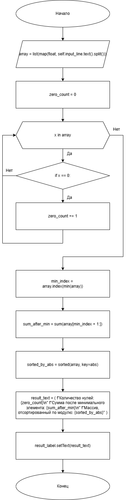
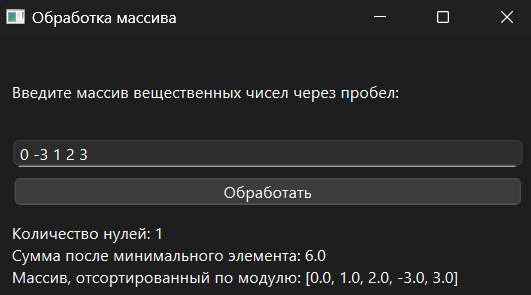

# Практическая работа №2

### Тема: Использование одномерных массивом

### Цель: приобрести навыки составления циклических программ с использование одномерных массивов

#### Задачи:

* повторить структуру операторов ввода-вывода массивов;
* повторить синтаксис оператора инициализации и ввода-вывода массивов;
* повторить основные библиотечные файлы, подключаемые при выполнении программ;
* усовершенствовать навыки составления программ с одномерными массивами;

#### Задание (Вариант 14)

> В одномерном массиве, состоящем из n вещественных элементов, вычислить:
> 1. Количество элементов массива, равных нулю
> 2. Сумму элементов массива, расположенных после минимального элемента.
> 3. Упорядочить элементы массива по возрастанию модулей.

#### Контрольный пример

> Ввожу массив: [0, -3, 1, 2, 3]
>
> Программа выводит:
> - Кол-во нулей: 1
> - Сумма после минимального: 6
> - Сортировка по модулю: [0, 1, 2, -3, 3]

#### Системный анализ

> Входные данные: `Array array`  
> Промежуточные данные: `Float zero_count` `Integer min_index`, `Float sum_after_min` `Array sorted_by_abs`  
> Выходные данные: `String result_text`

#### Блок-схема



#### Код программы

```python
import sys
from PySide6.QtWidgets import (
    QApplication, QWidget, QVBoxLayout, QLineEdit, QPushButton, QLabel, QMessageBox
)


class ArrayProcessor(QWidget):
    def __init__(self):
        super().__init__()
        self.setWindowTitle("Обработка массива")
        self.setGeometry(100, 100, 400, 200)

        self.layout = QVBoxLayout()

        self.input_label = QLabel("Введите массив вещественных чисел через пробел:")
        self.layout.addWidget(self.input_label)

        self.input_line = QLineEdit()
        self.layout.addWidget(self.input_line)

        self.process_button = QPushButton("Обработать")
        self.process_button.clicked.connect(self.process_array)
        self.layout.addWidget(self.process_button)

        self.result_label = QLabel("")
        self.result_label.setWordWrap(True)
        self.layout.addWidget(self.result_label)

        self.setLayout(self.layout)

    def process_array(self):
        try:
            array = list(map(float, self.input_line.text().split()))

            zero_count = sum(1 for x in array if x == 0)

            min_index = array.index(min(array))
            sum_after_min = sum(array[min_index + 1:])

            sorted_by_abs = sorted(array, key=abs)

            result_text = (
                f"Количество нулей: {zero_count}\n"
                f"Сумма после минимального элемента: {sum_after_min}\n"
                f"Массив, отсортированный по модулю: {sorted_by_abs}"
            )

            self.result_label.setText(result_text)

        except ValueError:
            QMessageBox.critical(self, "Ошибка", "Введите корректные числа через пробел!")


if __name__ == "__main__":
    app = QApplication(sys.argv)
    window = ArrayProcessor()
    window.show()
    sys.exit(app.exec())
```

#### Результат работы программы



#### Вывод по проделанной работе

> +repppp