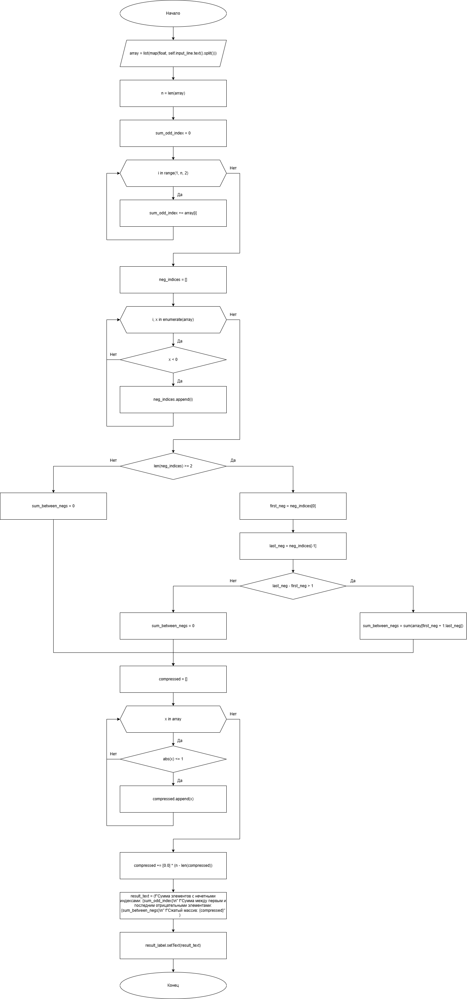
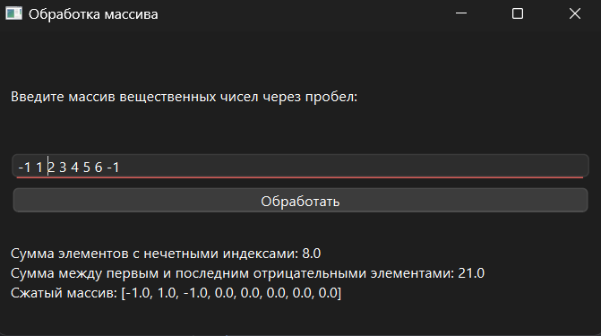

# Практическая работа №2

### Тема: Использование одномерных массивом

### Цель: приобрести навыки составления циклических программ с использование одномерных массивов

#### Задачи:

* повторить структуру операторов ввода-вывода массивов;
* повторить синтаксис оператора инициализации и ввода-вывода массивов;
* повторить основные библиотечные файлы, подключаемые при выполнении программ;
* усовершенствовать навыки составления программ с одномерными массивами;

#### Задание (Вариант 4)

> В одномерном массиве, состоящем из n вещественных элементов, вычислить:
> 1. сумму элементов массива с нечетными номерами
> 2. Сумму элементов массива, расположенных между первым и последним отрицательными элементами
> 3. Сжать массив, удалив из него все элементы, модуль которых превышает единицу. Освободившиеся в конце массива
     элементы заполнить нулями

#### Контрольный пример

> Ввожу массив: [-1, 1, 2, 3, 4, 5, 6, -1]  
> Получаю вывод:
> * Сумма элементов с нечетными индексами: 8
> * Сумма между первым и последним отрицательным элементами: 21
> * Сжатый массив [-1, 1, -1, 0, 0, 0, 0, 0]

#### Системный анализ

> Входные данные: `Array array`  
> Промежуточные данные: `Integer n` `Float sum_odd_index` `Array neg_indices` `Integer first_neg` `Integer last_neg`
`Float sum_between_negs` `Array compressed`  
> Выходные данные: `String result_text`

#### Блок-схема



#### Код программы

```python
import sys
from PySide6.QtWidgets import (
    QApplication, QWidget, QVBoxLayout, QLineEdit, QPushButton, QLabel, QMessageBox
)
from PySide6.QtCore import Qt


class ArrayProcessor(QWidget):
    def __init__(self):
        super().__init__()
        self.setWindowTitle("Обработка массива")
        self.setGeometry(100, 100, 500, 250)

        self.layout = QVBoxLayout()

        self.input_label = QLabel("Введите массив вещественных чисел через пробел:")
        self.layout.addWidget(self.input_label)

        self.input_line = QLineEdit()
        self.layout.addWidget(self.input_line)

        self.process_button = QPushButton("Обработать")
        self.process_button.clicked.connect(self.process_array)
        self.layout.addWidget(self.process_button)

        self.result_label = QLabel("")
        self.result_label.setWordWrap(True)
        self.layout.addWidget(self.result_label)

        self.setLayout(self.layout)

    def process_array(self):
        try:
            array = list(map(float, self.input_line.text().split()))
            n = len(array)

            sum_odd_index = sum(array[i] for i in range(1, n, 2))

            neg_indices = [i for i, x in enumerate(array) if x < 0]
            if len(neg_indices) >= 2:
                first_neg = neg_indices[0]
                last_neg = neg_indices[-1]
                if last_neg - first_neg > 1:
                    sum_between_negs = sum(array[first_neg + 1:last_neg])
                else:
                    sum_between_negs = 0
            else:
                sum_between_negs = 0

            compressed = [x for x in array if abs(x) <= 1]
            compressed += [0.0] * (n - len(compressed))

            result_text = (
                f"Сумма элементов с нечетными индексами: {sum_odd_index}\n"
                f"Сумма между первым и последним отрицательными элементами: {sum_between_negs}\n"
                f"Сжатый массив: {compressed}"
            )

            self.result_label.setText(result_text)

        except ValueError:
            QMessageBox.critical(self, "Ошибка", "Введите корректные числа через пробел!")


if __name__ == "__main__":
    app = QApplication(sys.argv)
    window = ArrayProcessor()
    window.show()
    sys.exit(app.exec())
```

#### Результат работы программы



#### Вывод по проделанной работе

> +reppp