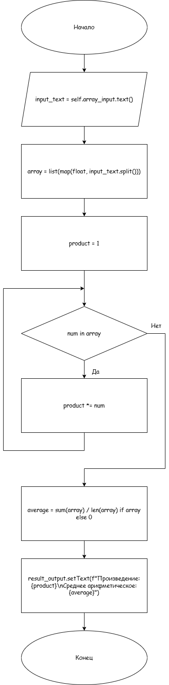
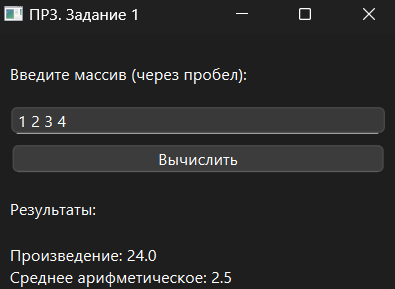

# Практическая работа №3

### Тема: «Обработка одномерных массивов»

### Цель: приобрести навыки составления циклических программ  с использованием одномерных массивов

#### Задачи:

* повторить структуру операторов ввода-вывода и использование циклов, вложенных циклов
* повторить синтаксис оператора инициализации и ввода-вывода массивов;
* повторить основные библиотечные файлы, подключаемые при выполнении программ;
* усовершенствовать навыки составления программ с одномерными массивами.

#### Задание

> Вариант 14. Определить:
> * произведение всех элементов массива;
> * среднее арифметическое всех элементов массива;

#### Контрольный пример

> Ввожу: 1, 2, 3, 4  
> Получаю:
> - Произведение: 24
> - Среднее арифметическое: 2,5

#### Системный анализ

> Входные данные: `input_text: str`  
> Промежуточные данные: `array: list` `product: int` `average: float`  
> Выходные данные: `result_output: str`

#### Блок-схема



#### Код программы

```python
import sys
from PySide6.QtWidgets import QApplication, QWidget, QVBoxLayout, QLabel, QLineEdit, QPushButton


class ArrayProcessingApp(QWidget):
    def __init__(self):
        super().__init__()

        self.setWindowTitle("ПР3. Задание 1")
        self.setGeometry(100, 100, 300, 200)

        layout = QVBoxLayout()

        self.array_input_label = QLabel("Введите массив (через пробел):")
        self.array_input = QLineEdit()
        self.result_label = QLabel("Результаты:")
        self.result_output = QLabel("Произведение: 0\nСреднее арифметическое: 0")

        self.calculate_button = QPushButton("Вычислить")
        self.calculate_button.clicked.connect(self.calculate_results)

        layout.addWidget(self.array_input_label)
        layout.addWidget(self.array_input)
        layout.addWidget(self.calculate_button)
        layout.addWidget(self.result_label)
        layout.addWidget(self.result_output)

        self.setLayout(layout)

    def calculate_results(self):
        try:
            input_text = self.array_input.text()
            array = list(map(float, input_text.split()))

            product = 1
            for num in array:
                product *= num

            average = sum(array) / len(array) if array else 0

            self.result_output.setText(f"Произведение: {product}\nСреднее арифметическое: {average}")
        except ValueError:
            self.result_output.setText("Ошибка: введите корректные числа через пробел.")


if __name__ == "__main__":
    app = QApplication(sys.argv)
    window = ArrayProcessingApp()
    window.show()
    sys.exit(app.exec())

```

#### Результат работы программы



#### Вывод по проделанной работе

> Круто!