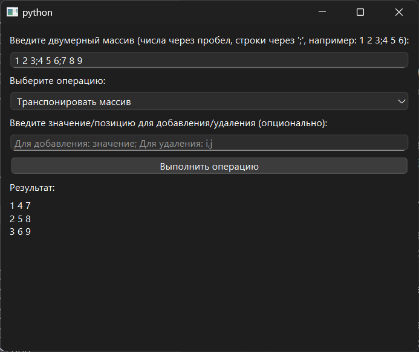

# Практическая работа №3

### Тема: «Обработка одномерных массивов»

### Цель: приобрести навыки составления циклических программ  с использованием одномерных массивов

#### Задачи:

* повторить структуру операторов ввода-вывода и использование циклов, вложенных циклов
* повторить синтаксис оператора инициализации и ввода-вывода массивов;
* повторить основные библиотечные файлы, подключаемые при выполнении программ;
* усовершенствовать навыки составления программ с одномерными массивами.

#### Задание

> С помощью встроенных функций выполните операции над одномерным массивом (сортировка, транспонирование и
> добавление/удаление одного элемента). Операции выбирать из списка.
> В массиве А[m,n] каждый элемент, кроме граничных заменить суммой непосредственно примыкающих к нему элементов по
> вертикали и горизонтали. (Лучше использовать другой массив B[m][n]).

#### Контрольный пример

> Ввожу:  
> 1 2 3;  
> 4 5 6;  
> 7 8 9;  
> 
> Получаю:  
> 1 4 7;  
> 2 5 8;  
> 7 8 9;  

#### Системный анализ

> Входные данные: `String input_text`  
> Промежуточные данные: `Array array` `Integer row` `String operation`  
> Выходные данные: `String result`  

#### Блок-схема


#### Код программы

```python
import sys
from PySide6.QtWidgets import QApplication, QWidget, QVBoxLayout, QLabel, QLineEdit, QPushButton, QComboBox, QMessageBox


class ArrayProcessingApp(QWidget):
    def __init__(self):
        super().__init__()

        self.setWindowTitle("PR3|Задание 3")
        self.setGeometry(100, 100, 500, 400)

        layout = QVBoxLayout()

        self.instruction_label = QLabel(
            "Введите двумерный массив (числа через пробел, строки через ';', например: 1 2 3;4 5 6):")
        self.array_input = QLineEdit()
        self.array_input.setPlaceholderText("Пример: 1 2 3;4 5 6")

        self.operation_label = QLabel("Выберите операцию:")
        self.operation_combo = QComboBox()
        self.operation_combo.addItems([
            "Транспонировать массив",
            "Сортировать строки",
            "Добавить элемент",
            "Удалить элемент",
            "Заменить элементы суммой соседей"
        ])

        self.element_input_label = QLabel("Введите значение/позицию для добавления/удаления (опционально):")
        self.element_input = QLineEdit()
        self.element_input.setPlaceholderText("Для добавления: значение; Для удаления: i,j")

        self.calculate_button = QPushButton("Выполнить операцию")
        self.calculate_button.clicked.connect(self.perform_operation)

        self.result_label = QLabel("Результат:")
        self.result_output = QLabel("")

        layout.addWidget(self.instruction_label)
        layout.addWidget(self.array_input)
        layout.addWidget(self.operation_label)
        layout.addWidget(self.operation_combo)
        layout.addWidget(self.element_input_label)
        layout.addWidget(self.element_input)
        layout.addWidget(self.calculate_button)
        layout.addWidget(self.result_label)
        layout.addWidget(self.result_output)
        layout.addStretch()

        self.setLayout(layout)

    def perform_operation(self):
        input_text = self.array_input.text().strip()
        if not input_text:
            self.show_error("Пожалуйста, введите массив.")
            return

        try:
            array = [list(map(int, row.split())) for row in input_text.split(';')]
            if not all(len(row) == len(array[0]) for row in array):
                self.show_error("Все строки должны иметь одинаковую длину.")
                return

            operation = self.operation_combo.currentText()
            if operation == "Транспонировать массив":
                result = self.transpose(array)
            elif operation == "Сортировать строки":
                result = self.sort_array(array)
            elif operation == "Добавить элемент":
                result = self.add_element(array)
            elif operation == "Удалить элемент":
                result = self.remove_element(array)
            elif operation == "Заменить элементы суммой соседей":
                result = self.replace_with_neighbor_sums(array)

            self.display_result(result)
        except ValueError:
            self.show_error("Неверный формат данных. Используйте числа, разделенные пробелами и строки через ';'.")

    def transpose(self, array):
        return list(map(list, zip(*array)))

    def sort_array(self, array):
        return [sorted(row) for row in array]

    def add_element(self, array):
        element_input = self.element_input.text().strip()
        if not element_input:
            self.show_error("Введите значение для добавления.")
            return array

        try:
            value = int(element_input)
            new_array = [row[:] for row in array]
            new_array[-1].append(value)
            return new_array
        except ValueError:
            self.show_error("Введите целое число для добавления.")
            return array

    def remove_element(self, array):
        element_input = self.element_input.text().strip()
        if not element_input:
            self.show_error("Введите позицию для удаления (i,j).")
            return array

        try:
            i, j = map(int, element_input.split(','))
            if i < 0 or i >= len(array) or j < 0 or j >= len(array[0]):
                self.show_error("Недопустимая позиция.")
                return array
            new_array = [row[:] for row in array]
            new_array[i].pop(j)
            return new_array
        except ValueError:
            self.show_error("Введите позицию в формате i,j (например, 0,1).")
            return array

    def replace_with_neighbor_sums(self, array):
        if len(array) < 2 or len(array[0]) < 2:
            self.show_error("Массив должен быть размером хотя бы 2x2.")
            return array

        m, n = len(array), len(array[0])
        result = [[0] * n for _ in range(m)]

        for i in range(m):
            for j in range(n):
                if i == 0 or i == m - 1 or j == 0 or j == n - 1:
                    result[i][j] = array[i][j]
                else:
                    result[i][j] = (array[i - 1][j] + array[i + 1][j] +
                                    array[i][j - 1] + array[i][j + 1])

        return result

    def display_result(self, result):
        if not result or not result[0]:
            self.result_output.setText("Результат: пустой массив")
            return
        result_text = "\n".join([" ".join(map(str, row)) for row in result])
        self.result_output.setText(result_text)

    def show_error(self, message):
        QMessageBox.critical(self, "Ошибка", message)


if __name__ == "__main__":
    app = QApplication(sys.argv)
    window = ArrayProcessingApp()
    window.show()
    sys.exit(app.exec())
```

#### Результат работы программы



#### Вывод по проделанной работе

> ВАЙБ КОДИНГ, ЖЕСТКИЙ