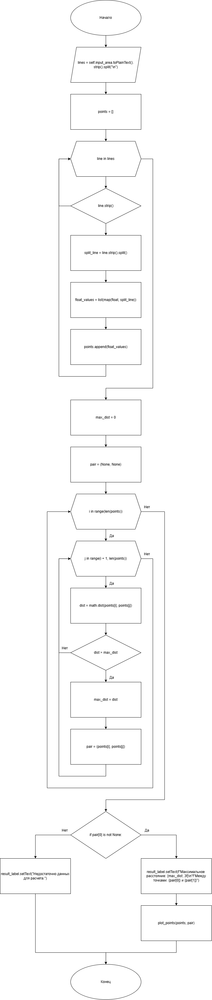
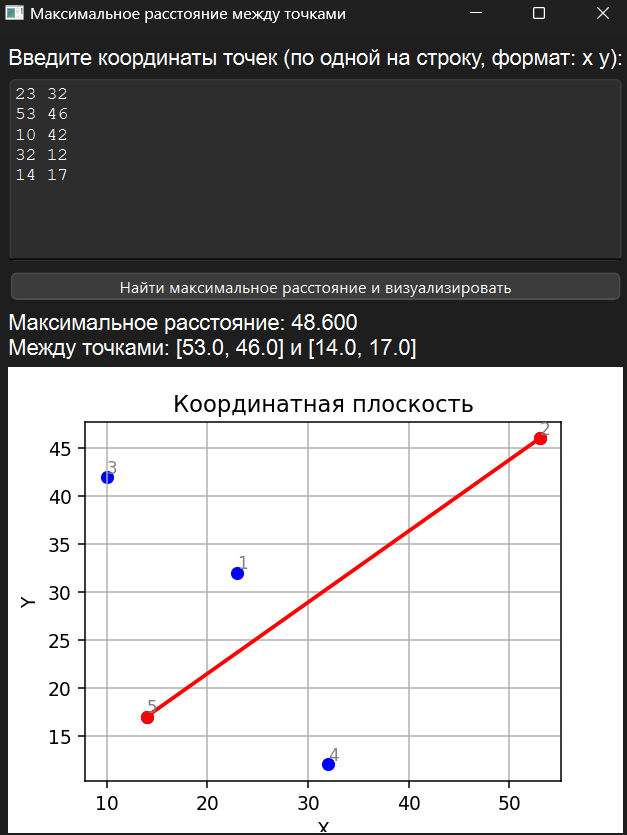

# Практическая работа № 4

### Тема: Применение сортировки массивов

### Цель: приобрести навыки составления циклических программ с использованием массивов и разных способов сортировки

#### Задачи:

> * повторить структуру операторов ввода-вывода и использование циклов, вложенных циклов
> * повторить синтаксис оператора инициализации и ввода-вывода массивов;
> * повторить основные библиотечные файлы, подключаемые при выполнении программ;
> * усовершенствовать навыки составления программ с массивами и их сортировкой.

#### Задание

> Дано множество A из N точек (точки заданы своими координатами x, y). Найти пару точек этого множества с максимальным
> расстоянием между ними и само это расстояние (точки выводятся в том же порядке, в котором они перечислены при задании
> множества A).

#### Контрольный пример

> Ввожу:  
> 1 0  
> 2 9  
> 3 8  
> 4 7  
> 5 6
>
> Получаю:  
> Максимальное расстояние: 9.055  
> Между точками [1, 0] и [2, 9]

#### Системный анализ

> Входные данные:  `Array lines`  
> Промежуточные данные: `Array points`, `Integer max_dist`, 'Array pair', `Float dist`  
> Выходные данные: `String result_label`

#### Блок-схема



#### Код программы

```python
import sys
import math
from PySide6.QtWidgets import (
    QApplication, QMainWindow, QWidget, QVBoxLayout, QPushButton,
    QTextEdit, QLabel
)
from PySide6.QtGui import QFont
from matplotlib.backends.backend_qtagg import FigureCanvasQTAgg as FigureCanvas
from matplotlib.figure import Figure


class DistanceVisualizer(QMainWindow):
    def __init__(self):
        super().__init__()
        self.setWindowTitle("")
        self.setGeometry(100, 100, 800, 600)

        self.central_widget = QWidget()
        self.setCentralWidget(self.central_widget)
        self.layout = QVBoxLayout(self.central_widget)

        self.instructions = QLabel("Введите координаты точек (по одной на строку, формат: x y):")
        self.instructions.setFont(QFont("Arial", 12))
        self.layout.addWidget(self.instructions)

        self.input_area = QTextEdit()
        self.input_area.setFont(QFont("Courier New", 10))
        self.layout.addWidget(self.input_area)

        self.button = QPushButton("Найти максимальное расстояние и визуализировать")
        self.button.clicked.connect(self.find_max_distance)
        self.layout.addWidget(self.button)

        self.result_label = QLabel("")
        self.result_label.setFont(QFont("Arial", 12))
        self.result_label.setWordWrap(True)
        self.layout.addWidget(self.result_label)

        self.figure = Figure(figsize=(5, 4))
        self.canvas = FigureCanvas(self.figure)
        self.layout.addWidget(self.canvas)

    def find_max_distance(self):
        try:
            lines = self.input_area.toPlainText().strip().split("\n")
            points = [list(map(float, line.strip().split())) for line in lines if line.strip()]

            max_dist = 0
            pair = (None, None)

            for i in range(len(points)):
                for j in range(i + 1, len(points)):
                    dist = math.dist(points[i], points[j])
                    if dist > max_dist:
                        max_dist = dist
                        pair = (points[i], points[j])

            if pair[0] is not None:
                self.result_label.setText(
                    f"Максимальное расстояние: {max_dist:.3f}\n"
                    f"Между точками: {pair[0]} и {pair[1]}"
                )
                self.plot_points(points, pair)
            else:
                self.result_label.setText("Недостаточно данных для расчета.")
        except Exception as e:
            self.result_label.setText(f"Ошибка: {str(e)}")

    def plot_points(self, points, max_pair):
        self.figure.clear()
        ax = self.figure.add_subplot(111)
        xs = [p[0] for p in points]
        ys = [p[1] for p in points]
        ax.scatter(xs, ys, color='blue')

        for i, (x, y) in enumerate(points):
            ax.text(x, y, f"{i + 1}", fontsize=9, color='gray', ha='left', va='bottom')

        if max_pair[0] and max_pair[1]:
            ax.plot([max_pair[0][0], max_pair[1][0]], [max_pair[0][1], max_pair[1][1]], color='red', linewidth=2)
            ax.scatter([max_pair[0][0], max_pair[1][0]], [max_pair[0][1], max_pair[1][1]], color='red')

        ax.set_title("Координатная плоскость")
        ax.set_xlabel("X")
        ax.set_ylabel("Y")
        ax.grid(True)
        self.canvas.draw()


if __name__ == "__main__":
    app = QApplication(sys.argv)
    window = DistanceVisualizer()
    window.show()
    sys.exit(app.exec())
```

#### Результат работы программы



#### Вывод по проделанной работе

