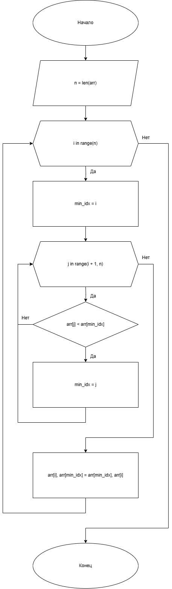

# Практическая работа № 4

### Тема: Применение сортировки массивов

### Цель: приобрести навыки составления циклических программ с использованием массивов и разных способов сортировки

#### Задачи:

> * повторить структуру операторов ввода-вывода и использование циклов, вложенных циклов
> * повторить синтаксис оператора инициализации и ввода-вывода массивов;
> * повторить основные библиотечные файлы, подключаемые при выполнении программ;
> * усовершенствовать навыки составления программ с массивами и их сортировкой.

#### Задание

> Сортировка массива методом выбора. Этот метод также рекомендуется использовать только для сортировки небольших
> массивов (порядка 30 элементов). Сортировка методом выбора начинается с выбора одного из элементов массива (например
> первого элемента). После этого делается просмотр всего массива и находится минимальное значение. Это значение
> помещается
> в начало; затем находится второй по возрастанию элемент и помещается на второе место и т.д.

#### Контрольный пример

> Ввожу: 1 0 2 9 3 8 4 7 5 6
>
> Получаю:   
> Исходный массив: [1, 0, 2, 9, 3, 8, 4, 7, 5, 6]  
> Отсортированный: [0, 1, 2, 3, 4, 5, 6, 7, 8, 9]

#### Системный анализ

> Входные данные:  `String text`   
> Промежуточные данные: `Array raw_numbers`, `Array array`, `Array sorted_array`  
> Выходные данные: `String result_label`

#### Блок-схема



#### Код программы

```python
import sys
from PySide6.QtWidgets import (
    QApplication, QMainWindow, QWidget, QVBoxLayout, QLabel,
    QTextEdit, QPushButton
)
from PySide6.QtGui import QFont


class SelectionSortApp(QMainWindow):
    def __init__(self):
        super().__init__()
        self.setWindowTitle("")
        self.setGeometry(100, 100, 600, 300)

        self.central_widget = QWidget()
        self.setCentralWidget(self.central_widget)
        self.layout = QVBoxLayout(self.central_widget)

        self.instructions = QLabel("Введите массив чисел (через пробел или запятую):")
        self.instructions.setFont(QFont("Arial", 12))
        self.layout.addWidget(self.instructions)

        self.input_area = QTextEdit()
        self.input_area.setFont(QFont("Courier New", 10))
        self.layout.addWidget(self.input_area)

        self.sort_button = QPushButton("Сортировать методом выбора")
        self.sort_button.clicked.connect(self.sort_array)
        self.layout.addWidget(self.sort_button)

        self.result_label = QLabel("")
        self.result_label.setFont(QFont("Arial", 12))
        self.result_label.setWordWrap(True)
        self.layout.addWidget(self.result_label)

    def sort_array(self):
        try:
            text = self.input_area.toPlainText()
            raw_numbers = text.replace(",", " ").split()
            array = [int(num) for num in raw_numbers]

            sorted_array = self.selection_sort(array.copy())

            self.result_label.setText(
                f"Исходный массив: {array}\n"
                f"Отсортированный: {sorted_array}"
            )
        except Exception as e:
            self.result_label.setText(f"Ошибка: {str(e)}")

    def selection_sort(self, arr):
        n = len(arr)
        for i in range(n):
            min_idx = i
            for j in range(i + 1, n):
                if arr[j] < arr[min_idx]:
                    min_idx = j
            arr[i], arr[min_idx] = arr[min_idx], arr[i]
        return arr


if __name__ == "__main__":
    app = QApplication(sys.argv)
    window = SelectionSortApp()
    window.show()
    sys.exit(app.exec())

```

#### Результат работы программы


#### Вывод по проделанной работе

