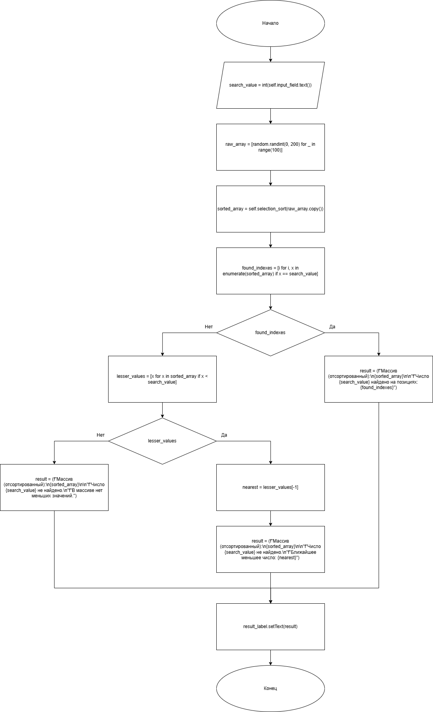
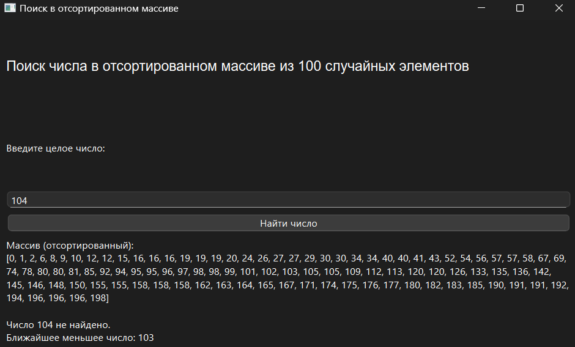
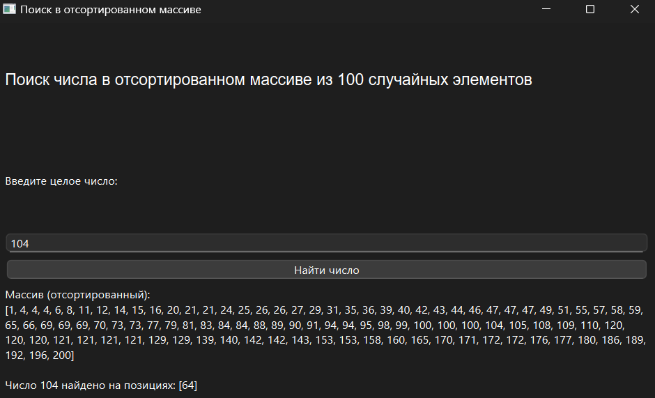

# Практическая работа № 4

### Тема: Применение сортировки массивов

### Цель: приобрести навыки составления циклических программ с использованием массивов и разных способов сортировки

#### Задачи:

> * повторить структуру операторов ввода-вывода и использование циклов, вложенных циклов
> * повторить синтаксис оператора инициализации и ввода-вывода массивов;
> * повторить основные библиотечные файлы, подключаемые при выполнении программ;
> * усовершенствовать навыки составления программ с массивами и их сортировкой.

#### Задание

> Напишите программу для поиска заданного числа в 100-значном массиве целых случайных чисел. (Для простоты поиска массив
> должен быть упорядочен по возрастанию одним из вышеперечисленных способов). Если заданное число встречается в массиве
> несколько раз, то необходимо сообщить местоположение (адреса) таких элементов. Если число не найдено – вывести
> соответствующее сообщение. Если число не найдено – искать ближайшее меньшее число к заданному.

#### Контрольный пример

> Ввожу: 22
> Получаю: Число найдено на позиции ...

#### Системный анализ

> Входные данные: `Integer search_value`  
> Промежуточные данные: `Array raw_array`, `Array sorted_array`, `Array found_indexes`, `Array lesser_values`, `Float
> nearest`  
> Выходные данные: `String result`

#### Блок-схема



#### Код программы

```python
import sys
import random
from PySide6.QtWidgets import (
    QApplication, QMainWindow, QWidget, QVBoxLayout,
    QLabel, QPushButton, QLineEdit
)
from PySide6.QtGui import QFont


class SearchInSortedArray(QMainWindow):
    def __init__(self):
        super().__init__()
        self.setWindowTitle("")
        self.setGeometry(100, 100, 700, 400)

        self.central_widget = QWidget()
        self.setCentralWidget(self.central_widget)
        self.layout = QVBoxLayout(self.central_widget)

        self.title = QLabel("Поиск числа в отсортированном массиве из 100 случайных элементов")
        self.title.setFont(QFont("Arial", 13))
        self.layout.addWidget(self.title)

        self.input_label = QLabel("Введите целое число:")
        self.layout.addWidget(self.input_label)

        self.input_field = QLineEdit()
        self.layout.addWidget(self.input_field)

        self.search_button = QPushButton("Найти число")
        self.search_button.clicked.connect(self.search_number)
        self.layout.addWidget(self.search_button)

        self.result_label = QLabel("")
        self.result_label.setWordWrap(True)
        self.layout.addWidget(self.result_label)

    def selection_sort(self, arr):
        for i in range(len(arr)):
            min_idx = i
            for j in range(i + 1, len(arr)):
                if arr[j] < arr[min_idx]:
                    min_idx = j
            arr[i], arr[min_idx] = arr[min_idx], arr[i]
        return arr

    def search_number(self):
        try:
            search_value = int(self.input_field.text())
            raw_array = [random.randint(0, 200) for _ in range(100)]
            sorted_array = self.selection_sort(raw_array.copy())

            found_indexes = [i for i, x in enumerate(sorted_array) if x == search_value]

            if found_indexes:
                result = (
                    f"Массив (отсортированный):\n{sorted_array}\n\n"
                    f"Число {search_value} найдено на позициях: {found_indexes}"
                )
            else:
                lesser_values = [x for x in sorted_array if x < search_value]
                if lesser_values:
                    nearest = lesser_values[-1]
                    result = (
                        f"Массив (отсортированный):\n{sorted_array}\n\n"
                        f"Число {search_value} не найдено.\n"
                        f"Ближайшее меньшее число: {nearest}"
                    )
                else:
                    result = (
                        f"Массив (отсортированный):\n{sorted_array}\n\n"
                        f"Число {search_value} не найдено.\n"
                        f"В массиве нет меньших значений."
                    )

            self.result_label.setText(result)

        except ValueError:
            self.result_label.setText("Ошибка: введите корректное целое число.")


if __name__ == "__main__":
    app = QApplication(sys.argv)
    window = SearchInSortedArray()
    window.show()
    sys.exit(app.exec())

```

#### Результат работы программы




#### Вывод по проделанной работе

