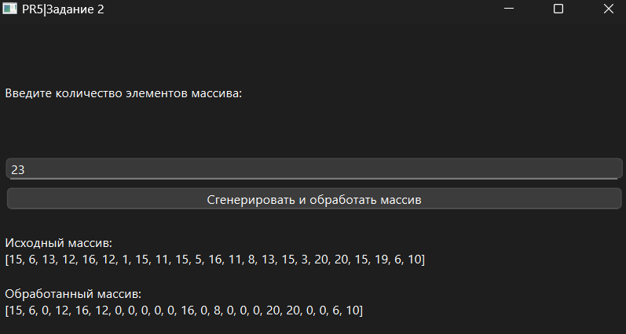

# Практическая работа №5

### Тема: Поиск элементов массива

### Цель: приобрести навыки составления программ с использованием одномерных массивов

#### Задачи:

> * повторить структуру операторов ввода-вывода и использование циклов, вложенных циклов
> * повторить синтаксис оператора инициализации и ввода-вывода массивов;
> * повторить основные библиотечные файлы, подключаемые при выполнении программ;
> * усовершенствовать навыки составления программ с одномерными массивами.

#### Задание

> Элементы массива, стоящие между четными, обнулить.

#### Контрольный пример

> Ввожу размер массива
> Получаю массив нужного размера, где все элементы между четными обнулены.

#### Системный анализ

> Входные данные: `Integer n`
> Промежуточные данные: `Array array`, `Array result_array` `Integer last_even_index`
> Выходные данные: `String result`

#### Блок-схема


#### Код программы

```python
import sys
import random
from PySide6.QtWidgets import (
    QApplication, QMainWindow, QWidget, QVBoxLayout, QLabel,
    QPushButton, QLineEdit
)


class App(QMainWindow):
    def __init__(self):
        super().__init__()
        self.setWindowTitle("")
        self.setGeometry(100, 100, 600, 300)

        self.central_widget = QWidget()
        self.setCentralWidget(self.central_widget)
        self.layout = QVBoxLayout(self.central_widget)

        self.label = QLabel("Введите количество элементов массива:")
        self.layout.addWidget(self.label)

        self.n_input = QLineEdit()
        self.layout.addWidget(self.n_input)

        self.button = QPushButton("Сгенерировать и обработать массив")
        self.button.clicked.connect(self.process_array)
        self.layout.addWidget(self.button)

        self.result = QLabel("")
        self.result.setWordWrap(True)
        self.layout.addWidget(self.result)

    def process_array(self):
        try:
            n = int(self.n_input.text())
            array = [random.randint(1, 20) for _ in range(n)]
            result_array = array.copy()

            last_even_index = -1
            for i in range(len(array)):
                if array[i] % 2 == 0:
                    if last_even_index != -1:
                        for j in range(last_even_index + 1, i):
                            result_array[j] = 0
                    last_even_index = i

            self.result.setText(
                f"Исходный массив:\n{array}\n\nОбработанный массив:\n{result_array}"
            )
        except:
            self.result.setText("Ошибка: введите корректное число элементов.")


if __name__ == "__main__":
    app = QApplication(sys.argv)
    window = App()
    window.show()
    sys.exit(app.exec())

```

#### Результат работы программы



#### Вывод по проделанной работе

