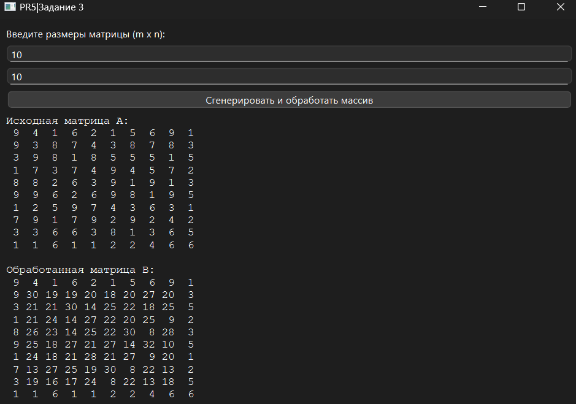

# Практическая работа №5

### Тема: Поиск элементов массива

### Цель: приобрести навыки составления программ с использованием одномерных массивов

#### Задачи:

> * повторить структуру операторов ввода-вывода и использование циклов, вложенных циклов
> * повторить синтаксис оператора инициализации и ввода-вывода массивов;
> * повторить основные библиотечные файлы, подключаемые при выполнении программ;
> * усовершенствовать навыки составления программ с одномерными массивами.

#### Задание

> В массиве А[m,n] каждый элемент, кроме граничных заменить суммой непосредственно примыкающих к нему элементов по
> вертикали и горизонтали. (Лучше использовать другой массив B[m][n]).

#### Контрольный пример

> Ввожу размер массива
> Получаю массив нужного размера, где все элементы между четными обнулены.

#### Системный анализ

> Входные данные: `Integer n` `Integer m`
> Промежуточные данные: `Array A`, `Array B` `Integer last_even_index`
> Выходные данные: `String result_label`

#### Блок-схема


#### Код программы

```python
import sys
import random
from PySide6.QtWidgets import (
    QApplication, QMainWindow, QWidget, QVBoxLayout, QLabel,
    QLineEdit, QPushButton
)
from PySide6.QtGui import QFont


class MatrixApp(QMainWindow):
    def __init__(self):
        super().__init__()
        self.setWindowTitle("")
        self.setGeometry(100, 100, 700, 400)

        self.central_widget = QWidget()
        self.setCentralWidget(self.central_widget)
        self.layout = QVBoxLayout(self.central_widget)

        self.layout.addWidget(QLabel("Введите размеры матрицы (m x n):"))

        self.m_input = QLineEdit()
        self.m_input.setPlaceholderText("Введите m")
        self.layout.addWidget(self.m_input)

        self.n_input = QLineEdit()
        self.n_input.setPlaceholderText("Введите n")
        self.layout.addWidget(self.n_input)

        self.button = QPushButton("Сгенерировать и обработать массив")
        self.button.clicked.connect(self.process_matrix)
        self.layout.addWidget(self.button)

        self.result_label = QLabel("")
        self.result_label.setFont(QFont("Courier New", 10))
        self.result_label.setWordWrap(True)
        self.layout.addWidget(self.result_label)

    def process_matrix(self):
        try:
            m = int(self.m_input.text())
            n = int(self.n_input.text())
            A = [[random.randint(1, 9) for _ in range(n)] for _ in range(m)]
            B = [[A[i][j] for j in range(n)] for i in range(m)]

            for i in range(1, m - 1):
                for j in range(1, n - 1):
                    B[i][j] = A[i - 1][j] + A[i + 1][j] + A[i][j - 1] + A[i][j + 1]

            def format_matrix(matrix):
                return "\n".join(" ".join(f"{num:2}" for num in row) for row in matrix)

            self.result_label.setText(
                f"Исходная матрица A:\n{format_matrix(A)}\n\n"
                f"Обработанная матрица B:\n{format_matrix(B)}"
            )
        except:
            self.result_label.setText("Ошибка: введите корректные целые числа для m и n.")


if __name__ == "__main__":
    app = QApplication(sys.argv)
    window = MatrixApp()
    window.show()
    sys.exit(app.exec())

```

#### Результат работы программы



#### Вывод по проделанной работе

