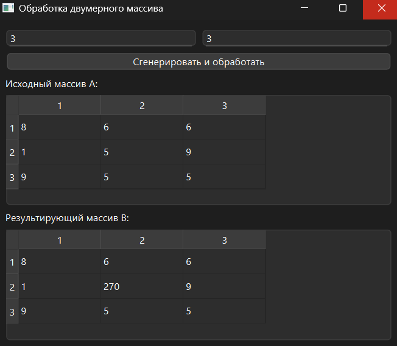

# Практическая работа № 6

### Тема: удаление элементов массива

### Цель: приобрести навыки составления программ с использованием одномерных массивов

#### Задачи:

* повторить структуру операторов ввода-вывода и использование циклов, вложенных циклов
* повторить синтаксис оператора инициализации и ввода-вывода массивов;
* повторить основные библиотечные файлы, подключаемые при выполнении программ;
* усовершенствовать навыки составления программ с одномерными массивами.

#### Задание

> В массиве А[m,n] каждый элемент, кроме граничных заменить произведением непосредственно примыкающих к нему элементов
> по вертикали и горизонтали. (Лучше использовать другой массив B[m][n]).

#### Контрольный пример

> Ввожу столбцы - 3, строки - 3  
> Получаю массив где, граничные элементы заменены произведением непосредственно примыкающих к ним элементов

#### Системный анализ

> Входные данные: `Integer n` `Integer m`
> Промежуточные данные: `Array A`, `Array B`  
> Выходные данные: `Array table_original`, `Array table_result`

#### Блок-схема


#### Код программы

```python
import sys
import random
from PySide6.QtWidgets import (
    QApplication, QWidget, QVBoxLayout, QLabel,
    QLineEdit, QPushButton, QMessageBox, QTableWidget,
    QTableWidgetItem, QHBoxLayout
)


class MatrixProcessor(QWidget):
    def __init__(self):
        super().__init__()
        self.setWindowTitle("")
        self.setGeometry(100, 100, 600, 400)

        self.layout = QVBoxLayout()

        input_layout = QHBoxLayout()
        self.rows_input = QLineEdit()
        self.rows_input.setPlaceholderText("Строк (m)")
        self.cols_input = QLineEdit()
        self.cols_input.setPlaceholderText("Столбцов (n)")
        input_layout.addWidget(self.rows_input)
        input_layout.addWidget(self.cols_input)
        self.layout.addLayout(input_layout)

        self.button_generate = QPushButton("Сгенерировать и обработать")
        self.button_generate.clicked.connect(self.generate_and_process)
        self.layout.addWidget(self.button_generate)

        self.label_original = QLabel("Исходный массив A:")
        self.layout.addWidget(self.label_original)
        self.table_original = QTableWidget()
        self.layout.addWidget(self.table_original)

        self.label_result = QLabel("Результирующий массив B:")
        self.layout.addWidget(self.label_result)
        self.table_result = QTableWidget()
        self.layout.addWidget(self.table_result)

        self.setLayout(self.layout)

    def generate_and_process(self):
        try:
            m = int(self.rows_input.text())
            n = int(self.cols_input.text())
            if m < 3 or n < 3:
                raise ValueError("Размеры должны быть не меньше 3x3.")
        except ValueError:
            QMessageBox.critical(self, "Ошибка", "Введите корректные размеры массива (минимум 3x3).")
            return

        A = [[random.randint(1, 9) for _ in range(n)] for _ in range(m)]
        B = [[A[i][j] for j in range(n)] for i in range(m)]  # Копия A

        for i in range(1, m - 1):
            for j in range(1, n - 1):
                B[i][j] = A[i - 1][j] * A[i + 1][j] * A[i][j - 1] * A[i][j + 1]

        self.display_table(self.table_original, A)
        self.display_table(self.table_result, B)

    def display_table(self, table, data):
        rows = len(data)
        cols = len(data[0])
        table.setRowCount(rows)
        table.setColumnCount(cols)
        for i in range(rows):
            for j in range(cols):
                table.setItem(i, j, QTableWidgetItem(str(data[i][j])))


if __name__ == "__main__":
    app = QApplication(sys.argv)
    window = MatrixProcessor()
    window.show()
    sys.exit(app.exec())

```

#### Результат работы программы



#### Вывод по проделанной работе

