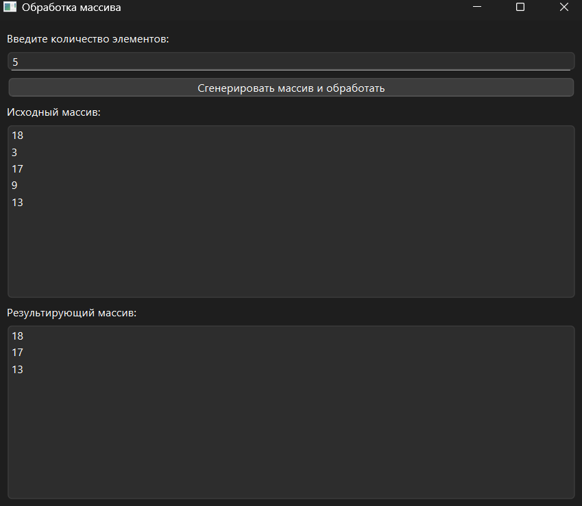

# Практическая работа № 6

### Тема: удаление элементов массива

### Цель: приобрести навыки составления программ с использованием одномерных массивов

#### Задачи:

* повторить структуру операторов ввода-вывода и использование циклов, вложенных циклов
* повторить синтаксис оператора инициализации и ввода-вывода массивов;
* повторить основные библиотечные файлы, подключаемые при выполнении программ;
* усовершенствовать навыки составления программ с одномерными массивами.

#### Задание

> Из массива удалить элементы, стоящие после максимального и имеющие значение меньше среднего арифметического всех
> элементов массива.

#### Контрольный пример

> Из массива A[5]: 8 6 9 4 5 должен получиться массив A[3]: 8 6 9 (среднее арифметическое четных элементов =(8+6+9+4+5)
> /5=6.4)

#### Системный анализ

> Входные данные: `Integer n`
> Промежуточные данные: `Array array` `Float average`, `Integer max_index`
> Выходные данные: `Array result`

#### Блок-схема


#### Код программы

```python
import sys
import random
from PySide6.QtWidgets import (
    QApplication, QWidget, QVBoxLayout, QLabel,
    QPushButton, QLineEdit, QMessageBox, QListWidget
)


class ArrayProcessor(QWidget):
    def __init__(self):
        super().__init__()
        self.setWindowTitle("")
        self.setGeometry(100, 100, 400, 300)

        self.layout = QVBoxLayout()

        self.input_label = QLabel("Введите количество элементов:")
        self.layout.addWidget(self.input_label)

        self.input_n = QLineEdit()
        self.layout.addWidget(self.input_n)

        self.button_generate = QPushButton("Сгенерировать массив и обработать")
        self.button_generate.clicked.connect(self.process_array)
        self.layout.addWidget(self.button_generate)

        self.original_list = QListWidget()
        self.layout.addWidget(QLabel("Исходный массив:"))
        self.layout.addWidget(self.original_list)

        self.result_list = QListWidget()
        self.layout.addWidget(QLabel("Результирующий массив:"))
        self.layout.addWidget(self.result_list)

        self.setLayout(self.layout)

    def process_array(self):
        try:
            n = int(self.input_n.text())
            if n <= 0:
                raise ValueError
        except ValueError:
            QMessageBox.critical(self, "Ошибка", "Введите корректное положительное число.")
            return

        array = [random.randint(1, 20) for _ in range(n)]
        self.original_list.clear()
        self.original_list.addItems(map(str, array))

        average = sum(array) / len(array)
        max_index = array.index(max(array))

        result = array[:max_index + 1]
        for value in array[max_index + 1:]:
            if value >= average:
                result.append(value)

        self.result_list.clear()
        self.result_list.addItems(map(str, result))


if __name__ == "__main__":
    app = QApplication(sys.argv)
    window = ArrayProcessor()
    window.show()
    sys.exit(app.exec())

```

#### Результат работы программы



#### Вывод по проделанной работе

