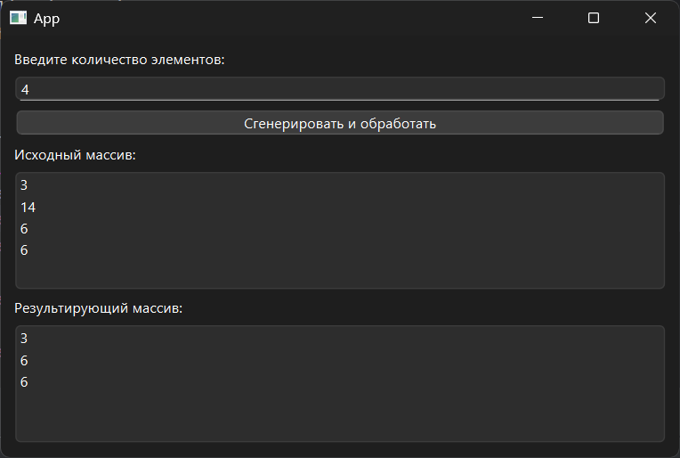

# Практическая работа № 7

### Тема: удаление последовательности элементов массива

### Цель: приобрести навыки составления программ с использованием одномерных массивов

#### Задачи:

* повторить структуру операторов ввода-вывода и использование циклов, вложенных циклов
* повторить синтаксис оператора инициализации и ввода-вывода массивов;
* повторить основные библиотечные файлы, подключаемые при выполнении программ;
* усовершенствовать навыки составления программ с одномерными массивами.

#### Задание

> Удалить первый четный элемент массива, имеющий нечетный индекс.

#### Контрольный пример

> Массив 7 2 6 5 4 4 10 3 9 четные элементы 2 6 4 4 10 с нечетными индексами 6 4 10 первый из них 6 массив после удаления 7 2 5 4 4 10 3 9

#### Системный анализ

> Входные данные: `Integer n`  
> Промежуточные данные: `Array array`  
> Выходные данные: `String result`  

#### Блок-схема


#### Код программы

```python
import sys
import random
from PySide6.QtWidgets import (
    QApplication, QWidget, QVBoxLayout, QLabel,
    QPushButton, QLineEdit, QMessageBox, QListWidget
)


class RemoveEvenAtOddIndex(QWidget):
    def __init__(self):
        super().__init__()
        self.setWindowTitle("")
        self.setGeometry(100, 100, 400, 300)

        self.layout = QVBoxLayout()

        self.layout.addWidget(QLabel("Введите количество элементов:"))

        self.input_n = QLineEdit()
        self.layout.addWidget(self.input_n)

        self.button_process = QPushButton("Сгенерировать и обработать")
        self.button_process.clicked.connect(self.process_array)
        self.layout.addWidget(self.button_process)

        self.original_list = QListWidget()
        self.layout.addWidget(QLabel("Исходный массив:"))
        self.layout.addWidget(self.original_list)

        self.result_list = QListWidget()
        self.layout.addWidget(QLabel("Результирующий массив:"))
        self.layout.addWidget(self.result_list)

        self.setLayout(self.layout)

    def process_array(self):
        try:
            n = int(self.input_n.text())
            if n <= 1:
                raise ValueError
        except ValueError:
            QMessageBox.critical(self, "Ошибка", "Введите корректное число (>1).")
            return

        array = [random.randint(1, 20) for _ in range(n)]
        self.original_list.clear()
        self.original_list.addItems(map(str, array))

        result = array.copy()
        for i in range(1, len(result), 2):
            if result[i] % 2 == 0:
                result.pop(i)
                break

        self.result_list.clear()
        self.result_list.addItems(map(str, result))


if __name__ == "__main__":
    app = QApplication(sys.argv)
    window = RemoveEvenAtOddIndex()
    window.show()
    sys.exit(app.exec())

```

#### Результат работы программы



#### Вывод по проделанной работе

