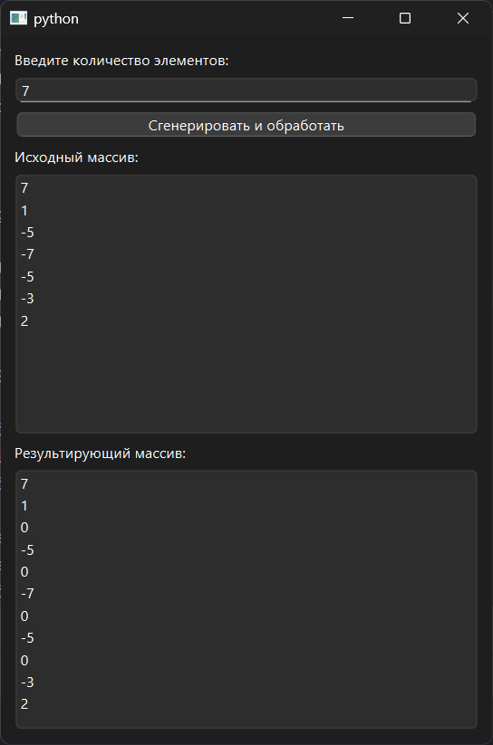

# Практическая работа № 8

### Тема: вставка элементов массива

### Цель: приобрести навыки составления программ с использованием одномерных массивов

#### Задачи:

* повторить структуру операторов ввода-вывода и использование циклов, вложенных циклов
* повторить синтаксис оператора инициализации и ввода-вывода массивов;
* повторить основные библиотечные файлы, подключаемые при выполнении программ;
* усовершенствовать навыки составления программ с одномерными массивами.

#### Задание

> Дан массив размера N. Перед каждым отрицательным элементом массива вставить элемент с нулевым значением.

#### Контрольный пример

> Массив -1 10 2 -2 3, должен преобразоваться в 0 -1 10 2 0 -2 3

#### Системный анализ

> Входные данные: `Integer n`  
> Промежуточные данные: `Array array`, `Integer num`
> Выходные данные: `Array result`

#### Блок-схема


#### Код программы

```python
import sys
import random
from PySide6.QtWidgets import (
    QApplication, QWidget, QVBoxLayout, QLabel,
    QLineEdit, QPushButton, QListWidget, QMessageBox
)


class InsertZeroBeforeNegative(QWidget):
    def __init__(self):
        super().__init__()
        self.setWindowTitle("")
        self.setGeometry(100, 100, 400, 300)

        self.layout = QVBoxLayout()

        self.layout.addWidget(QLabel("Введите количество элементов:"))
        self.input_n = QLineEdit()
        self.layout.addWidget(self.input_n)

        self.button_process = QPushButton("Сгенерировать и обработать")
        self.button_process.clicked.connect(self.process_array)
        self.layout.addWidget(self.button_process)

        self.original_list = QListWidget()
        self.layout.addWidget(QLabel("Исходный массив:"))
        self.layout.addWidget(self.original_list)

        self.result_list = QListWidget()
        self.layout.addWidget(QLabel("Результирующий массив:"))
        self.layout.addWidget(self.result_list)

        self.setLayout(self.layout)

    def process_array(self):
        try:
            n = int(self.input_n.text())
            if n <= 0:
                raise ValueError
        except ValueError:
            QMessageBox.critical(self, "Ошибка", "Введите корректное положительное число.")
            return

        array = [random.randint(-10, 10) for _ in range(n)]
        self.original_list.clear()
        self.original_list.addItems(map(str, array))

        result = []
        for num in array:
            if num < 0:
                result.append(0)
            result.append(num)

        self.result_list.clear()
        self.result_list.addItems(map(str, result))


if __name__ == "__main__":
    app = QApplication(sys.argv)
    window = InsertZeroBeforeNegative()
    window.show()
    sys.exit(app.exec())

```

#### Результат работы программы



#### Вывод по проделанной работе

