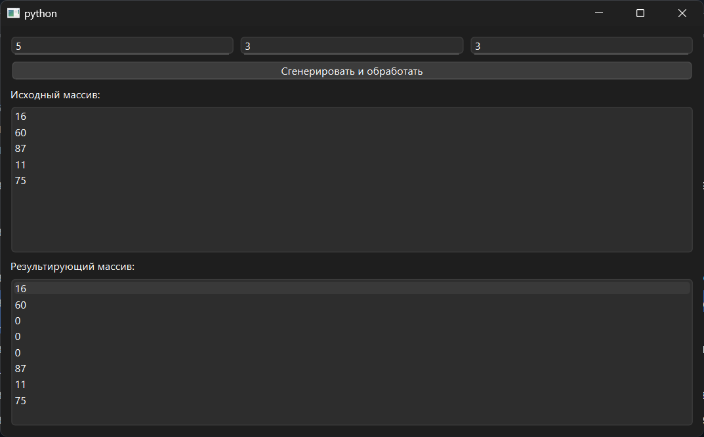

# Практическая работа № 8

### Тема: вставка элементов массива

### Цель: приобрести навыки составления программ с использованием одномерных массивов

#### Задачи:

* повторить структуру операторов ввода-вывода и использование циклов, вложенных циклов
* повторить синтаксис оператора инициализации и ввода-вывода массивов;
* повторить основные библиотечные файлы, подключаемые при выполнении программ;
* усовершенствовать навыки составления программ с одномерными массивами.

#### Задание

> Дан массив размера N и два целых числа K и M (1 ≤ K ≤ N, 1 ≤ M ≤ 10). Перед элементом массива с номером K вставить M
> новых элементов с нулевыми значениями

#### Контрольный пример

> Массив: [-1, 10, 2, -2, 3]
> K=3 и М=2
> Результат: [-1, 10, 2, 0, 0, -2, 3]

#### Системный анализ

> Входные данные: `Integer n` `Integer k` `Integer m`  
> Промежуточные данные: `Array A`, `Integer num`
> Выходные данные: `Array result`

#### Блок-схема


#### Код программы

```python
import sys
import random
from PySide6.QtWidgets import (
    QApplication, QWidget, QVBoxLayout, QLabel,
    QLineEdit, QPushButton, QListWidget, QHBoxLayout, QMessageBox
)


class InsertZerosBeforeK(QWidget):
    def __init__(self):
        super().__init__()
        self.setWindowTitle("")
        self.setGeometry(100, 100, 500, 350)

        layout = QVBoxLayout()

        input_layout = QHBoxLayout()
        self.input_n = QLineEdit()
        self.input_n.setPlaceholderText("Размер массива N")
        self.input_k = QLineEdit()
        self.input_k.setPlaceholderText("Номер элемента K (1-based)")
        self.input_m = QLineEdit()
        self.input_m.setPlaceholderText("Сколько нулей вставить M")
        input_layout.addWidget(self.input_n)
        input_layout.addWidget(self.input_k)
        input_layout.addWidget(self.input_m)
        layout.addLayout(input_layout)

        self.button = QPushButton("Сгенерировать и обработать")
        self.button.clicked.connect(self.process)
        layout.addWidget(self.button)

        self.list_original = QListWidget()
        layout.addWidget(QLabel("Исходный массив:"))
        layout.addWidget(self.list_original)

        self.list_result = QListWidget()
        layout.addWidget(QLabel("Результирующий массив:"))
        layout.addWidget(self.list_result)

        self.setLayout(layout)

    def process(self):
        try:
            n = int(self.input_n.text())
            k = int(self.input_k.text())
            m = int(self.input_m.text())

            if not (1 <= k <= n) or not (1 <= m <= 10):
                raise ValueError
        except ValueError:
            QMessageBox.critical(self, "Ошибка", "Введите корректные значения:\n1 ≤ K ≤ N, 1 ≤ M ≤ 10")
            return

        A = [random.randint(1, 99) for _ in range(n)]
        self.list_original.clear()
        self.list_original.addItems(map(str, A))

        result = A[:k - 1] + [0] * m + A[k - 1:]

        self.list_result.clear()
        self.list_result.addItems(map(str, result))


if __name__ == "__main__":
    app = QApplication(sys.argv)
    window = InsertZerosBeforeK()
    window.show()
    sys.exit(app.exec())

```

#### Результат работы программы



#### Вывод по проделанной работе

