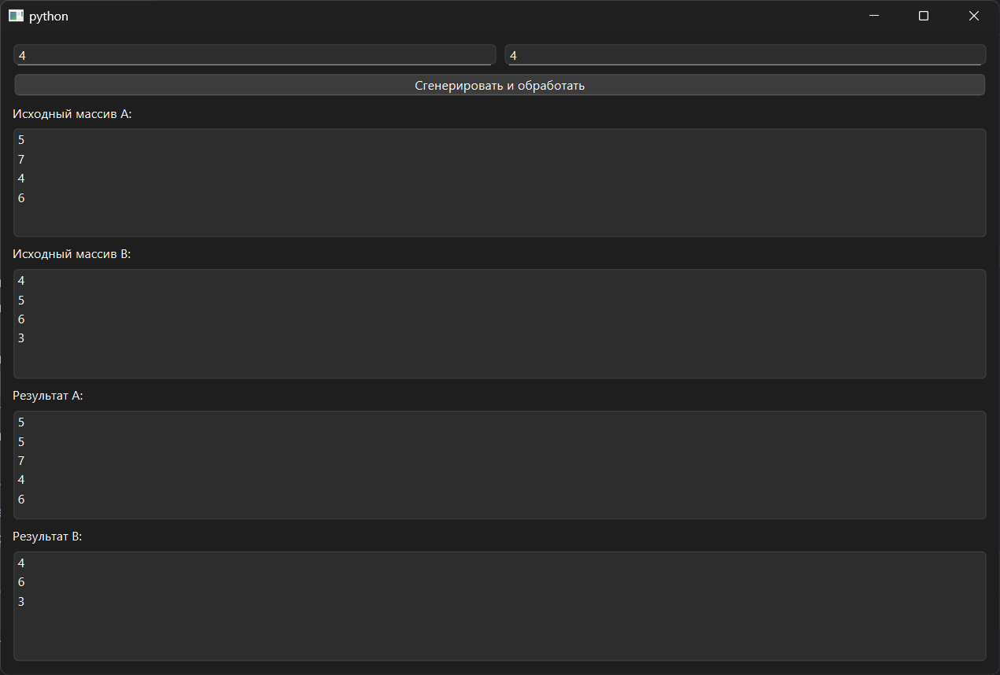

# Практическая работа №9

### Тема: использование массивов и файлов

### Цель: приобрести навыки составления программ с использованием массивов и команд для работы с файлами

#### Задачи:

* повторить структуру операторов ввода-вывода и использование файлов, вложенных циклов
* повторить синтаксис оператора инициализации и ввода-вывода массивов;
* повторить основные библиотечные файлы, подключаемые при выполнении программ;
* усовершенствовать навыки составления программ с массивами и файлами.

#### Задание

> Вводятся массивы А и В. В начало массива А переписать нечетные элементы массива В, расположенные левее максимального
> элемента.

#### Контрольный пример

> Пример: массив А 7 3 7 5 4 3 массив В 1 3 4 2 3 6 1 максимальный элемент В 6 нечетные элементы В 1 3 3 1 левее
> максимального 1 3 3 массив А после обработки 1 3 3 7 3 7 5 4 3 массив В после обработки 4 2 6 1

#### Системный анализ

> Входные данные: `Integer size_a` `Integer size_a`  
> Промежуточные данные: `Array A` `Array B` `Integer max_index` `Array odd_before_max` `Array b_modified`
`Float count_to_remove` `Array new_b` `Float new_a`  
> Выходные данные: `Array list_a2` `Array list_b2`

#### Блок-схема


#### Код программы

```python
import sys
import random
from PySide6.QtWidgets import (
    QApplication, QWidget, QVBoxLayout, QLabel,
    QLineEdit, QPushButton, QListWidget, QHBoxLayout, QMessageBox
)


class ProcessArrays(QWidget):
    def __init__(self):
        super().__init__()
        self.setWindowTitle("")
        self.setGeometry(100, 100, 500, 400)

        layout = QVBoxLayout()

        input_layout = QHBoxLayout()
        self.input_a = QLineEdit()
        self.input_a.setPlaceholderText("Размер массива A")
        self.input_b = QLineEdit()
        self.input_b.setPlaceholderText("Размер массива B")
        input_layout.addWidget(self.input_a)
        input_layout.addWidget(self.input_b)
        layout.addLayout(input_layout)

        self.button = QPushButton("Сгенерировать и обработать")
        self.button.clicked.connect(self.process)
        layout.addWidget(self.button)

        self.label_a1 = QLabel("Исходный массив A:")
        layout.addWidget(self.label_a1)
        self.list_a1 = QListWidget()
        layout.addWidget(self.list_a1)

        self.label_b1 = QLabel("Исходный массив B:")
        layout.addWidget(self.label_b1)
        self.list_b1 = QListWidget()
        layout.addWidget(self.list_b1)

        self.label_a2 = QLabel("Результат A:")
        layout.addWidget(self.label_a2)
        self.list_a2 = QListWidget()
        layout.addWidget(self.list_a2)

        self.label_b2 = QLabel("Результат B:")
        layout.addWidget(self.label_b2)
        self.list_b2 = QListWidget()
        layout.addWidget(self.list_b2)

        self.setLayout(layout)

    def process(self):
        try:
            size_a = int(self.input_a.text())
            size_b = int(self.input_b.text())
            if size_a <= 0 or size_b <= 0:
                raise ValueError
        except ValueError:
            QMessageBox.critical(self, "Ошибка", "Введите корректные размеры массивов (>0).")
            return

        A = [random.randint(1, 9) for _ in range(size_a)]
        B = [random.randint(1, 9) for _ in range(size_b)]

        self.list_a1.clear()
        self.list_a1.addItems(map(str, A))
        self.list_b1.clear()
        self.list_b1.addItems(map(str, B))

        max_index = B.index(max(B))

        odd_before_max = [x for x in B[:max_index] if x % 2 != 0]

        b_modified = B.copy()
        count_to_remove = Counter(odd_before_max)
        new_b = []
        for x in b_modified:
            if count_to_remove.get(x, 0) > 0 and b_modified.index(x) < max_index:
                count_to_remove[x] -= 1
            else:
                new_b.append(x)

        new_a = odd_before_max + A

        self.list_a2.clear()
        self.list_a2.addItems(map(str, new_a))

        self.list_b2.clear()
        self.list_b2.addItems(map(str, new_b))


from collections import Counter

if __name__ == "__main__":
    app = QApplication(sys.argv)
    window = ProcessArrays()
    window.show()
    sys.exit(app.exec())

```

#### Результат работы программы



#### Вывод по проделанной работе

> mee