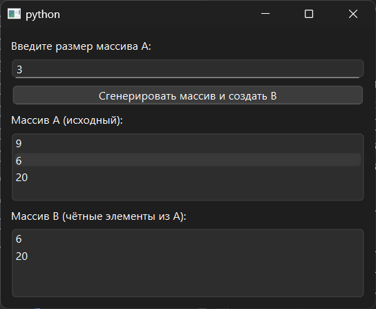

# Практическая работа №9

### Тема: использование массивов и файлов

### Цель: приобрести навыки составления программ с использованием массивов и команд для работы с файлами

#### Задачи:

* повторить структуру операторов ввода-вывода и использование файлов, вложенных циклов
* повторить синтаксис оператора инициализации и ввода-вывода массивов;
* повторить основные библиотечные файлы, подключаемые при выполнении программ;
* усовершенствовать навыки составления программ с массивами и файлами.

#### Задание

> Создать массив В из четных элементов массива А. Массив А не изменять.

#### Контрольный пример

> Генерирую массив, получаю второй массив где находятся только четные элементы

#### Системный анализ

> Входные данные: `Integer n`  
> Промежуточные данные: `Array A` `Array B`  
> Выходные данные: `Array list_a2` `Array list_b2`

#### Блок-схема


#### Код программы

```python
import sys
import random
from PySide6.QtWidgets import (
    QApplication, QWidget, QVBoxLayout, QLabel,
    QPushButton, QLineEdit, QListWidget, QMessageBox
)


class EvenElementsArray(QWidget):
    def __init__(self):
        super().__init__()
        self.setWindowTitle("")
        self.setGeometry(100, 100, 400, 300)

        self.layout = QVBoxLayout()

        self.layout.addWidget(QLabel("Введите размер массива A:"))
        self.input_n = QLineEdit()
        self.layout.addWidget(self.input_n)

        self.button_generate = QPushButton("Сгенерировать массив и создать B")
        self.button_generate.clicked.connect(self.process_arrays)
        self.layout.addWidget(self.button_generate)

        self.list_a = QListWidget()
        self.layout.addWidget(QLabel("Массив A (исходный):"))
        self.layout.addWidget(self.list_a)

        self.list_b = QListWidget()
        self.layout.addWidget(QLabel("Массив B (чётные элементы из A):"))
        self.layout.addWidget(self.list_b)

        self.setLayout(self.layout)

    def process_arrays(self):
        try:
            n = int(self.input_n.text())
            if n <= 0:
                raise ValueError
        except ValueError:
            QMessageBox.critical(self, "Ошибка", "Введите корректное положительное число.")
            return

        A = [random.randint(1, 99) for _ in range(n)]
        B = [x for x in A if x % 2 == 0]

        self.list_a.clear()
        self.list_a.addItems(map(str, A))

        self.list_b.clear()
        self.list_b.addItems(map(str, B))


if __name__ == "__main__":
    app = QApplication(sys.argv)
    window = EvenElementsArray()
    window.show()
    sys.exit(app.exec())

```

#### Результат работы программы



#### Вывод по проделанной работе

> mee